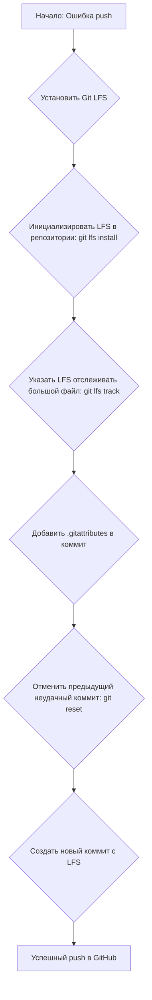

# План по исправлению ошибки с большим файлом в Git

## Проблема

При попытке отправить изменения в удаленный репозиторий GitHub возникает ошибка:
```
remote: error: File ftdna_haplo/data/get.json is 101.94 MB; this exceeds GitHub's file size limit of 100.00 MB
```
Это происходит потому, что GitHub не позволяет напрямую загружать файлы размером более 100 МБ.

## Решение

Мы будем использовать **Git Large File Storage (Git LFS)** для отслеживания больших файлов. Это расширение для Git, которое заменяет большие файлы в вашем репозитории на текстовые указатели, в то время как сами файлы хранятся на удаленном сервере, например, на GitHub.

## Пошаговый план выполнения

1.  **Установка Git LFS.**
    *   Сначала нужно убедиться, что у вас установлен Git LFS. Мы выполним команду для его установки в систему.

2.  **Настройка Git LFS в проекте.**
    *   Мы инициализируем Git LFS в вашем локальном репозитории с помощью команды `git lfs install`.

3.  **Отслеживание большого файла.**
    *   Мы укажем Git LFS, что он должен отслеживать файл `ftdna_haplo/data/get.json`. Это делается командой `git lfs track "ftdna_haplo/data/get.json"`.
    *   Эта команда создаст или обновит файл `.gitattributes` в корне проекта, добавив в него соответствующую строку.

4.  **Добавление `.gitattributes` в индекс.**
    *   Файл `.gitattributes` необходимо добавить в коммит, чтобы Git знал, какие файлы отслеживаются через LFS. Мы сделаем это с помощью `git add .gitattributes`.

5.  **Перезапись истории коммитов (при необходимости).**
    *   Поскольку большой файл уже был добавлен в коммит, который не удалось отправить, нам нужно будет "откатить" этот коммит, чтобы применить LFS к файлу, а затем создать новый коммит. Самый простой способ - это сделать `git reset --soft HEAD~1`, что отменит последний коммит, но оставит все изменения в индексе.

6.  **Создание нового коммита.**
    *   После сброса мы заново добавим все файлы (`git add .`) и создадим новый коммит. На этот раз файл `get.json` будет обработан через Git LFS.

7.  **Отправка изменений в репозиторий.**
    *   Наконец, мы выполним `git push origin main`, чтобы отправить исправленный коммит и большой файл (уже через LFS) на GitHub.

## Диаграмма процесса (Mermaid)



Пожалуйста, просмотрите этот план. Если вы согласны, мы перейдем к его выполнению.