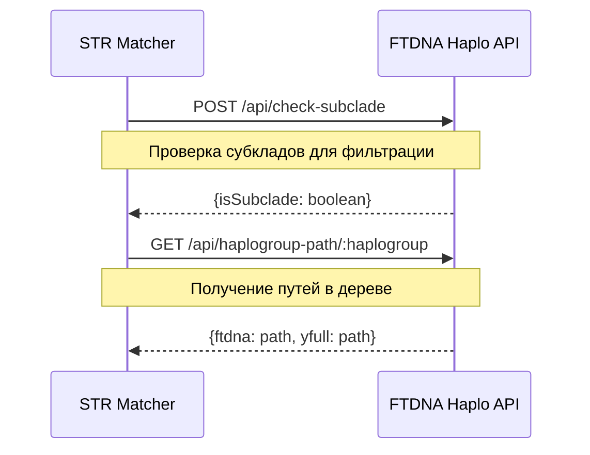

# Архитектура системы DNA-utils-universal

## 🏗️ Общая архитектура

DNA-utils-universal представляет собой микросервисную систему для анализа Y-STR маркеров и гаплогрупп Y-хромосомы.

```
┌─────────────────────────────────────────────────────────────┐
│                    DNA-utils-universal                      │
├─────────────────────┬─────────────────────┬─────────────────┤
│    STR Matcher      │    FTDNA Haplo     │  YSTr Predictor │
│   (Next.js :9002)   │                    │   (Python ML)   │
│                     │  ┌─────────────────┐ │                │
│  ┌─────────────────┐ │  │ Server :9003    │ │  ┌─────────────┐ │
│  │ React Frontend  │ │  │ (Node.js/API)  │ │  │ FastAPI     │ │
│  │                 │ │  └─────────────────┘ │  │ (в разработке)│ │
│  │ ┌─────────────┐ │ │  ┌─────────────────┐ │  └─────────────┘ │
│  │ │Web Workers  │ │ │  │ Client :5173    │ │                 │
│  │ │(STR calc)   │ │ │  │ (React/Vite)    │ │                 │
│  │ └─────────────┘ │ │  └─────────────────┘ │                 │  
│  └─────────────────┘ │                     │                 │
└─────────────────────┴─────────────────────┴─────────────────┘
```

## 🔗 Взаимодействие компонентов

### STR Matcher ↔ FTDNA Haplo


## 📊 Компонент 1: STR Matcher (порт 9002)

### Технологический стек
- **Framework**: Next.js 14
- **UI**: React + Tailwind CSS
- **State**: Redux Toolkit + React Hooks
- **Storage**: IndexedDB (локальное хранение)
- **Workers**: Web Workers для расчетов
- **HTTP**: Axios для API запросов

### Архитектура компонентов
```
src/
├── app/                    # Next.js App Router
├── components/
│   ├── str-matcher/        # Основные компоненты
│   │   ├── STRMatcher.tsx     # Главный контейнер
│   │   ├── MatchesTable.tsx   # Таблица результатов
│   │   ├── DataRepositories.tsx # Загрузка данных
│   │   └── HaplogroupFilter.tsx # Фильтр гаплогрупп
│   └── ui/                 # UI компоненты
├── hooks/                  # React хуки
│   ├── useSTRMatcher.ts       # Основная логика
│   └── useHaplogroups.ts      # Работа с гаплогруппами
├── workers/                # Web Workers
│   └── comparison.worker.ts   # Расчет дистанций
├── utils/                  # Утилиты
└── store/                  # Redux store
```

### Ключевые особенности

#### Web Workers для производительности
```typescript
// comparison.worker.ts
export class STRComparisonWorker {
  executeMatching(params: MatchingParams): void {
    // Расчет генетических дистанций в отдельном потоке
    // Предотвращение блокировки UI
  }
}
```

#### Многоуровневая фильтрация
1. **Web Worker**: Первичная фильтрация по дистанции
2. **API запросы**: Проверка субкладов через FTDNA Haplo
3. **Client-side**: Финальные UI фильтры

#### Система выделения маркеров
```css
/* 5 уровней редкости */
.marker-rarity-common { background: #fef3f2; }        /* 20-33% */
.marker-rarity-uncommon { background: #fed7cc; }      /* 12-20% */
.marker-rarity-rare { background: #fb9b7a; }          /* 8-12% */
.marker-rarity-very-rare { background: #f97316; }     /* 4-8% */
.marker-rarity-extremely-rare { background: #dc2626; } /* <4% */
```

## 📊 Компонент 2: FTDNA Haplo (порты 9003, 5173)

### Серверная часть (Node.js :9003)

#### Технологический стек
- **Runtime**: Node.js
- **Framework**: Express.js
- **Data Processing**: Custom classes
- **CORS**: Настроенный для микросервисов

#### Архитектура серверных классов
```
server/
├── server.js              # Express сервер + маршруты
├── services/
│   └── haplogroup-service.js  # Бизнес-логика
├── haplo_functions.js     # FTDNA дерево
├── yfull_adapter.js       # YFull интеграция
├── search_integration.js  # Поиск соответствий
└── path_builder.js        # Построение путей
```

#### Ключевые API эндпоинты
```javascript
// Основные маршруты
GET  /api/search/:haplogroup           // Поиск гаплогруппы
GET  /api/haplogroup-path/:haplogroup  // Путь в дереве
POST /api/check-subclade               // Проверка субкладов ⚠️ КРИТИЧЕСКИЙ
GET  /api/autocomplete                 // Автодополнение
```

### Клиентская часть (React/Vite :5173)

#### Компоненты визуализации
- **HaploViewer.jsx**: Основной интерфейс поиска
- **HaploFilters.jsx**: Фильтрация результатов  
- **HaplogroupTree.jsx**: Визуализация дерева

## 📊 Компонент 3: YSTr Predictor (в разработке)

**Статус**: Заглушка на будущее
- Python/FastAPI основа
- Модели машинного обучения
- Интеграция планируется

## 🔄 Управление процессами (PM2)

### Конфигурация ecosystem.config.js
```javascript
module.exports = {
  apps: [
    {
      name: 'str-matcher-2',
      script: 'next dev',
      cwd: './str-matcher',
      env: { PORT: 9002, NEXT_PUBLIC_API_URL: 'http://host:9003/api' }
    },
    {
      name: 'ftdna-haplo-2',
      script: './server/server.js', 
      cwd: './ftdna_haplo',
      env: { PORT: 9003, ALLOWED_ORIGINS: 'http://host:9002,http://host:5173' }
    },
    {
      name: 'haplo-client',
      script: 'vite --host 0.0.0.0',
      cwd: './ftdna_haplo/client',
      env: { PORT: 5173, VITE_API_URL: 'http://host:9003/api' }
    }
  ]
}
```

## 🗄️ Структуры данных

### STR Profile Format
```typescript
interface STRProfile {
  kitNumber: string;        // Уникальный ID теста
  name: string;            // Имя тестируемого  
  country: string;         // Страна
  haplogroup: string;      // Гаплогруппа (может быть неполной)
  markers: {               // Y-STR маркеры
    [marker: string]: string;
  };
}
```

### Haplogroup Details Format
```typescript
interface HaplogroupDetails {
  id: string;
  name: string;
  path: {
    nodes: Array<{
      id: string;
      name: string;
      variants: string[];    // SNP маркеры
    }>;
    string: string;          // "A > B > ... > R-M269"
  };
  statistics: {
    totalKits: number;
    countryStats: CountryStats[];
  };
}
```

## 🔐 Безопасность и CORS

### CORS конфигурация
```javascript
// Разрешенные origins для межсервисного взаимодействия
const allowedOrigins = [
  'http://localhost:9002',   // STR Matcher
  'http://localhost:5173',   // Haplo Client  
  'https://str.aadna.ru:8443' // Production
];
```

### Next.js Proxy Setup
```javascript
// next.config.js - проксирование API запросов
module.exports = {
  async rewrites() {
    return [
      {
        source: '/api/:path*',
        destination: 'http://localhost:9003/api/:path*'
      }
    ]
  }
}
```

## ⚡ Производительность и оптимизации

### Кэширование
- **Map-based кэширование**: Преобразованные узлы YFull
- **IndexedDB**: Локальное хранение STR профилей
- **Browser cache**: Статические ресурсы

### Lazy Loading
- **Chunked JSON**: Загрузка больших баз по частям
- **Progressive rendering**: Постепенная отрисовка таблиц
- **On-demand**: Детали гаплогрупп по запросу

### Web Workers
```typescript
// Расчеты в отдельном потоке
class ComparisonWorker {
  // Расчет дистанций без блокировки UI
  // Batch processing для больших данных
  // Early termination при превышении лимитов
}
```

## 🔍 Алгоритмы

### Расчет генетических дистанций
```typescript
enum CalculationMode {
  STANDARD = 'standard',      // Простой подсчет различий
  MODAL = 'modal',           // Учет мутационных скоростей  
  INFINITE_ALLELE = 'infinite_allele' // Модель бесконечных аллелей
}
```

### Проверка субкладов (критически важно!)
```javascript
// Алгоритм в HaploTree.isSubclade()
isSubclade(haplogroup, parentHaplogroup) {
  // 1. Проверка базовых гаплогрупп (R, R1, R1a)
  // 2. Получение полных путей в дереве
  // 3. Проверка: является ли путь родителя префиксом пути потомка
  const isSubclade = parentPath.every((name, index) => 
    name === haploPath[index]
  );
  return isSubclade;
}
```

## 🌐 Источники данных

### Google Sheets Integration
```typescript
// Поддерживаемые базы
const REPOSITORIES = [
  'AADNA.ru Database',     // Основная база
  'R1a Database',          // Специализированные по гаплогруппам
  'J1/J2 Database',        // Семитские гаплогруппы
  'G/E/I Databases',       // Европейские гаплогруппы
  'Genopoisk'              // Российская база
];
```

### Chunked JSON для больших баз
```javascript
// R1b база (16 чанков)
{
  id: 'r1b',
  type: 'chunked_json',
  url: '/chunk_',
  chunks: 16,
  batchSize: 4  // Загружаем по 4 чанка одновременно
}
```

## ⚠️ Критические особенности

### 1. Фильтрация по субкладам
- **НЕ просто по названию**: Учитывает филогенетические связи
- **Включение потенциальных матчей**: Оставляет тех, кто может подойти
- **API зависимость**: Критически зависит от check-subclade эндпоинта

### 2. Обработка коротких SNP  
- **Проблемные маркеры**: R-Y6, Y4, Y2, Y3
- **Специальная обработка**: PathBuilder для проблемных случаев
- **Точное сопоставление**: Избежание ложных совпадений

### 3. Палиндромные маркеры
```typescript
// DYS385, DYS459 и др.
const palindromes = {
  'DYS385': 2,  // Ожидается 2 значения
  'DYS459': 2,  // Формат: "value1-value2"
  'DYS464': 4   // Может быть до 4 значений
};
```

## 🚀 Deployment Architecture

### Development
```bash
npm run dev    # Запуск всех сервисов через PM2
```

### Production  
```bash
npm run build  # Сборка всех компонентов
npm start      # Запуск в продакшене
```

### Docker Support (планируется)
- Containerized микросервисы
- Docker Compose для оркестрации
- Health checks и мониторинг

---

*Архитектура обновлена: Август 2025*