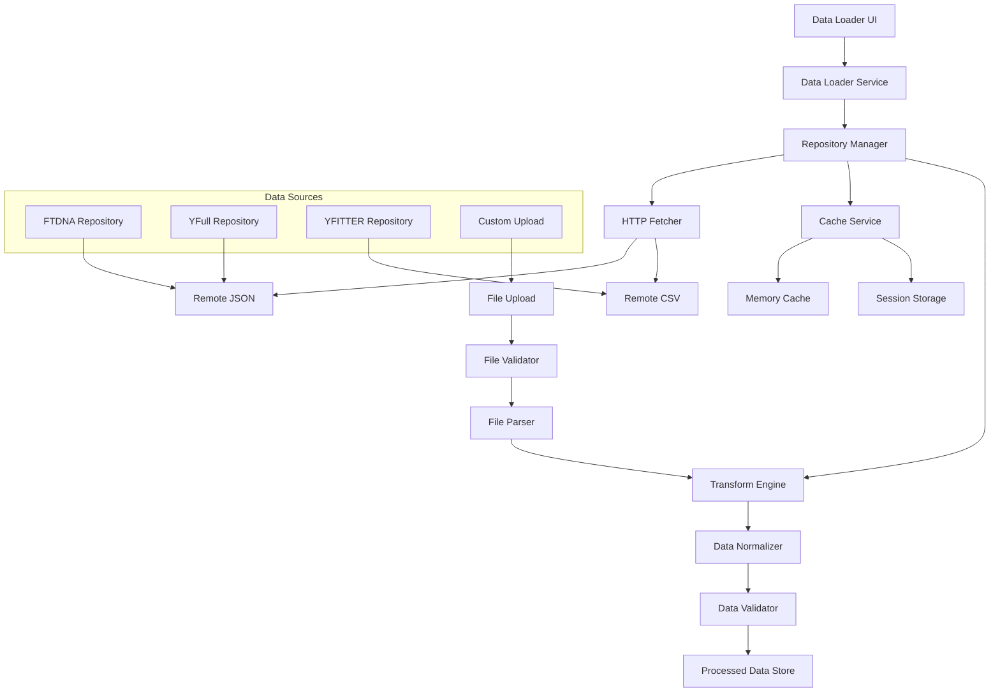

# 📥 Система загрузки данных DNA-utils-universal

## 📋 Обзор

Система загрузки данных является критически важным компонентом DNA-utils-universal, обеспечивающим получение и обработку генетических данных из различных источников. Система спроектирована для работы с большими объемами данных (50,000+ записей) и обеспечивает отказоустойчивость, кэширование и прогрессивную загрузку.

## 🏗️ Архитектура системы загрузки



## 🎛️ Основные компоненты

### 1. Data Loader UI Component

```typescript
// str-matcher/src/components/data-loader/DataLoader.tsx
import React, { useState, useCallback, useEffect } from 'react';
import { useDataLoader } from '../../hooks/useDataLoader';
import { Repository, LoadingStatus } from '../../types/data-loading.types';

interface DataLoaderProps {
  onDataLoaded: (repositories: Repository[]) => void;
  onError: (error: Error) => void;
}

const DataLoader: React.FC<DataLoaderProps> = ({ onDataLoaded, onError }) => {
  const [selectedRepositories, setSelectedRepositories] = useState<string[]>([]);
  const [loadingProgress, setLoadingProgress] = useState<Map<string, LoadingStatus>>(new Map());
  
  const {
    availableRepositories,
    loadRepositories,
    isLoading,
    error
  } = useDataLoader();
  
  const handleLoadData = useCallback(async () => {
    if (selectedRepositories.length === 0) {
      onError(new Error('Выберите хотя бы один источник данных'));
      return;
    }
    
    console.log(`📥 Начинаем загрузку ${selectedRepositories.length} репозиториев`);
    
    try {
      const repositories = await loadRepositories(
        selectedRepositories,
        (repoName, progress) => {
          setLoadingProgress(prev => new Map(prev.set(repoName, progress)));
        }
      );
      
      onDataLoaded(repositories);
      console.log(`✅ Загрузка завершена: ${repositories.length} репозиториев`);
      
    } catch (error) {
      console.error('❌ Ошибка загрузки данных:', error);
      onError(error);
    }
  }, [selectedRepositories, loadRepositories, onDataLoaded, onError]);
  
  const handleRepositoryToggle = useCallback((repoName: string) => {
    setSelectedRepositories(prev => 
      prev.includes(repoName)
        ? prev.filter(name => name !== repoName)
        : [...prev, repoName]
    );
  }, []);
  
  return (
    <div className="data-loader">
      <div className="data-loader__header">
        <h2>🗄️ Загрузка данных</h2>
        <p className="text-muted">
          Выберите источники данных для анализа Y-STR маркеров
        </p>
      </div>
      
      <div className="data-loader__repositories">
        {availableRepositories.map(repo => (
          <RepositoryCard
            key={repo.name}
            repository={repo}
            selected={selectedRepositories.includes(repo.name)}
            loading={loadingProgress.get(repo.name)}
            onToggle={handleRepositoryToggle}
          />
        ))}
      </div>
      
      {selectedRepositories.length > 0 && (
        <div className="data-loader__actions">
          <button
            className="btn btn-primary"
            onClick={handleLoadData}
            disabled={isLoading}
          >
            {isLoading ? (
              <>
                <span className="spinner-border spinner-border-sm me-2" />
                Загрузка...
              </>
            ) : (
              `📥 Загрузить данные (${selectedRepositories.length})`
            )}
          </button>
        </div>
      )}
      
      {error && (
        <div className="alert alert-danger mt-3">
          <strong>Ошибка загрузки:</strong> {error.message}
        </div>
      )}
    </div>
  );
};

// Карточка репозитория с подробной информацией
const RepositoryCard: React.FC<{
  repository: Repository;
  selected: boolean;
  loading?: LoadingStatus;
  onToggle: (name: string) => void;
}> = ({ repository, selected, loading, onToggle }) => {
  const getStatusIcon = () => {
    if (loading) {
      switch (loading.status) {
        case 'loading': return '📥';
        case 'processing': return '⚙️';
        case 'complete': return '✅';
        case 'error': return '❌';
        default: return '📊';
      }
    }
    return selected ? '✅' : '📊';
  };
  
  const formatSize = (bytes: number) => {
    if (bytes === 0) return '0 Bytes';
    const k = 1024;
    const sizes = ['Bytes', 'KB', 'MB', 'GB'];
    const i = Math.floor(Math.log(bytes) / Math.log(k));
    return parseFloat((bytes / Math.pow(k, i)).toFixed(2)) + ' ' + sizes[i];
  };
  
  return (
    <div 
      className={`repository-card ${selected ? 'selected' : ''} ${loading ? 'loading' : ''}`}
      onClick={() => onToggle(repository.name)}
    >
      <div className="repository-card__header">
        <span className="repository-card__icon">{getStatusIcon()}</span>
        <h3 className="repository-card__name">{repository.name}</h3>
        <span className={`repository-card__priority priority-${repository.priority}`}>
          Priority {repository.priority}
        </span>
      </div>
      
      <p className="repository-card__description">
        {repository.description}
      </p>
      
      <div className="repository-card__metadata">
        <div className="metadata-item">
          <span className="label">Records:</span>
          <span className="value">{repository.metadata?.recordCount?.toLocaleString() || 'Unknown'}</span>
        </div>
        
        <div className="metadata-item">
          <span className="label">Size:</span>
          <span className="value">
            {repository.metadata?.fileSize ? formatSize(repository.metadata.fileSize) : 'Unknown'}
          </span>
        </div>
        
        <div className="metadata-item">
          <span className="label">Updated:</span>
          <span className="value">
            {repository.metadata?.lastUpdated 
              ? new Date(repository.metadata.lastUpdated).toLocaleDateString()
              : 'Unknown'
            }
          </span>
        </div>
        
        <div className="metadata-item">
          <span className="label">Quality:</span>
          <span className={`value quality-${repository.metadata?.qualityScore || 50}`}>
            {repository.metadata?.qualityScore || 50}/100
          </span>
        </div>
      </div>
      
      {loading && (
        <div className="repository-card__progress">
          <div className="progress-bar">
            <div 
              className="progress-fill"
              style={{ 
                width: loading.percentage ? `${loading.percentage}%` : '0%' 
              }}
            />
          </div>
          
          <div className="progress-text">
            {loading.status === 'loading' && loading.loaded && loading.total && (
              `${loading.loaded.toLocaleString()} / ${loading.total.toLocaleString()}`
            )}
            {loading.status === 'processing' && loading.batch && loading.totalBatches && (
              `Batch ${loading.batch} / ${loading.totalBatches}`
            )}
            {loading.status === 'complete' && 'Completed'}
            {loading.status === 'error' && 'Error'}
          </div>
        </div>
      )}
    </div>
  );
};

export default DataLoader;
```

### 2. Data Loader Service (основная логика)

```typescript
// str-matcher/src/services/data-loader.service.ts
import { Repository, LoadingStatus, ProcessedEntry } from '../types/data-loading.types';
import { CacheService } from './cache.service';
import { TransformEngine } from './transform-engine.service';
import { DataValidator } from './data-validator.service';

export class DataLoaderService {
  private cacheService: CacheService;
  private transformEngine: TransformEngine;
  private validator: DataValidator;
  private activeRequests: Map<string, Promise<Repository>>;
  
  constructor() {
    this.cacheService = new CacheService();
    this.transformEngine = new TransformEngine();
    this.validator = new DataValidator();
    this.activeRequests = new Map();
  }
  
  async loadRepositories(
    repositoryNames: string[],
    onProgress?: (repoName: string, progress: LoadingStatus) => void
  ): Promise<Repository[]> {
    console.log(`🚀 Загрузка репозиториев: ${repositoryNames.join(', ')}`);
    
    const loadPromises = repositoryNames.map(name => 
      this.loadSingleRepository(name, onProgress)
    );
    
    // Загружаем все репозитории параллельно
    const results = await Promise.allSettled(loadPromises);
    
    const successfulRepositories: Repository[] = [];
    const errors: Error[] = [];
    
    results.forEach((result, index) => {
      if (result.status === 'fulfilled') {
        successfulRepositories.push(result.value);
      } else {
        const repoName = repositoryNames[index];
        console.error(`❌ Ошибка загрузки ${repoName}:`, result.reason);
        errors.push(new Error(`${repoName}: ${result.reason.message}`));
      }
    });
    
    if (errors.length > 0 && successfulRepositories.length === 0) {
      throw new Error(`Все репозитории не удалось загрузить: ${errors.map(e => e.message).join('; ')}`);
    }
    
    if (errors.length > 0) {
      console.warn(`⚠️ Частичная загрузка: ${errors.length} репозиториев не загружены`);
    }
    
    console.log(`✅ Загружено ${successfulRepositories.length} репозиториев`);
    return successfulRepositories;
  }
  
  private async loadSingleRepository(
    repositoryName: string,
    onProgress?: (repoName: string, progress: LoadingStatus) => void
  ): Promise<Repository> {
    // Предотвращаем дублирование запросов
    if (this.activeRequests.has(repositoryName)) {
      console.log(`⏳ Ожидание активного запроса для ${repositoryName}`);
      return await this.activeRequests.get(repositoryName)!;
    }
    
    const loadPromise = this.performRepositoryLoad(repositoryName, onProgress);
    this.activeRequests.set(repositoryName, loadPromise);
    
    try {
      const result = await loadPromise;
      return result;
    } finally {
      this.activeRequests.delete(repositoryName);
    }
  }
  
  private async performRepositoryLoad(
    repositoryName: string,
    onProgress?: (repoName: string, progress: LoadingStatus) => void
  ): Promise<Repository> {
    const config = this.getRepositoryConfig(repositoryName);
    if (!config) {
      throw new Error(`Неизвестный репозиторий: ${repositoryName}`);
    }
    
    const cacheKey = `repo_${repositoryName}_${config.version || 'latest'}`;
    
    // Проверяем кэш
    const cached = await this.cacheService.get(cacheKey);
    if (cached && this.isCacheValid(cached)) {
      console.log(`📋 Репозиторий ${repositoryName} загружен из кэша`);
      onProgress?.(repositoryName, { 
        status: 'complete', 
        loaded: cached.data.length, 
        total: cached.data.length 
      });
      return cached;
    }
    
    // Загружаем данные
    onProgress?.(repositoryName, { status: 'loading', loaded: 0, total: null });
    
    const rawData = await this.fetchRepositoryData(config, (progress) => {
      onProgress?.(repositoryName, { ...progress, status: 'loading' });
    });
    
    // Обрабатываем данные
    onProgress?.(repositoryName, { status: 'processing', loaded: 0, total: rawData.length });
    
    const processedData = await this.processRawData(rawData, config, (progress) => {
      onProgress?.(repositoryName, { ...progress, status: 'processing' });
    });
    
    // Валидируем данные
    const validatedData = this.validator.validateDataset(processedData);
    
    const repository: Repository = {
      name: repositoryName,
      description: config.description,
      url: config.url,
      type: config.type,
      enabled: config.enabled,
      priority: config.priority,
      data: validatedData.validEntries,
      metadata: {
        lastUpdated: new Date().toISOString(),
        recordCount: validatedData.validEntries.length,
        qualityScore: this.calculateQualityScore(validatedData),
        source: repositoryName,
        loadTime: Date.now(),
        fileSize: this.estimateDataSize(validatedData.validEntries),
        validationReport: validatedData.issues
      }
    };
    
    // Кэшируем результат
    await this.cacheService.set(cacheKey, repository, { priority: 'high' });
    
    onProgress?.(repositoryName, { 
      status: 'complete', 
      loaded: repository.data.length, 
      total: repository.data.length 
    });
    
    console.log(`✅ ${repositoryName}: ${repository.data.length} записей загружено`);
    return repository;
  }
  
  private async fetchRepositoryData(
    config: RepositoryConfig,
    onProgress?: (progress: Partial<LoadingStatus>) => void
  ): Promise<any[]> {
    if (!config.url) {
      throw new Error(`URL не задан для репозитория ${config.name}`);
    }
    
    console.log(`🌐 Загрузка данных из ${config.url}`);
    
    const response = await fetch(config.url);
    
    if (!response.ok) {
      throw new Error(`HTTP ${response.status}: ${response.statusText}`);
    }
    
    const contentLength = response.headers.get('content-length');
    const totalSize = contentLength ? parseInt(contentLength) : null;
    
    // Потоковая загрузка для больших файлов
    if (totalSize && totalSize > 5 * 1024 * 1024) { // > 5MB
      return await this.streamLargeFile(response, totalSize, onProgress);
    }
    
    // Обычная загрузка для небольших файлов
    const data = await response.json();
    onProgress?.({ loaded: data.length, total: data.length });
    
    return Array.isArray(data) ? data : [data];
  }
  
  private async streamLargeFile(
    response: Response,
    totalSize: number,
    onProgress?: (progress: Partial<LoadingStatus>) => void
  ): Promise<any[]> {
    const reader = response.body!.getReader();
    let receivedLength = 0;
    const chunks: Uint8Array[] = [];
    
    console.log(`🌊 Потоковая загрузка файла размером ${totalSize} байт`);
    
    while (true) {
      const { done, value } = await reader.read();
      
      if (done) break;
      
      chunks.push(value);
      receivedLength += value.length;
      
      onProgress?.({
        loaded: receivedLength,
        total: totalSize,
        percentage: (receivedLength / totalSize) * 100
      });
      
      // Даем браузеру передышку каждые 1MB
      if (receivedLength % (1024 * 1024) === 0) {
        await new Promise(resolve => setTimeout(resolve, 1));
      }
    }
    
    // Объединяем чанки и парсим JSON
    const allChunks = new Uint8Array(receivedLength);
    let position = 0;
    
    for (const chunk of chunks) {
      allChunks.set(chunk, position);
      position += chunk.length;
    }
    
    const decoder = new TextDecoder();
    const jsonString = decoder.decode(allChunks);
    const data = JSON.parse(jsonString);
    
    return Array.isArray(data) ? data : [data];
  }
  
  private async processRawData(
    rawData: any[],
    config: RepositoryConfig,
    onProgress?: (progress: Partial<LoadingStatus>) => void
  ): Promise<ProcessedEntry[]> {
    const processedData: ProcessedEntry[] = [];
    const batchSize = 1000;
    const totalBatches = Math.ceil(rawData.length / batchSize);
    
    console.log(`⚙️ Обработка ${rawData.length} записей в ${totalBatches} батчах`);
    
    for (let i = 0; i < rawData.length; i += batchSize) {
      const batch = rawData.slice(i, i + batchSize);
      const processedBatch = await this.transformEngine.processBatch(batch, config);
      
      processedData.push(...processedBatch);
      
      onProgress?.({
        loaded: processedData.length,
        total: rawData.length,
        batch: Math.floor(i / batchSize) + 1,
        totalBatches
      });
      
      // Передышка каждый батч
      await new Promise(resolve => setTimeout(resolve, 1));
    }
    
    return processedData;
  }
  
  private getRepositoryConfig(name: string): RepositoryConfig | null {
    const repositories: RepositoryConfig[] = [
      {
        name: 'FTDNA',
        description: 'Family Tree DNA Y-STR Database - крупнейшая база Y-STR данных',
        url: '/data/ftdna-ystr-haplotypes.json',
        type: 'json',
        enabled: true,
        priority: 1,
        version: '2024.1'
      },
      {
        name: 'YFull',
        description: 'YFull Phylogenetic Tree - научное филогенетическое дерево',
        url: '/data/yfull-samples.json',
        type: 'json',
        enabled: true,
        priority: 2,
        version: '11.07.00'
      },
      {
        name: 'YFITTER',
        description: 'YFITTER Statistical Dataset - калибровочные данные',
        url: '/data/yfitter-dataset.csv',
        type: 'csv',
        enabled: true,
        priority: 3,
        version: '2023.2'
      }
    ];
    
    return repositories.find(repo => repo.name === name) || null;
  }
  
  private isCacheValid(cached: Repository): boolean {
    if (!cached.metadata?.lastUpdated) return false;
    
    const cacheAge = Date.now() - new Date(cached.metadata.lastUpdated).getTime();
    const maxAge = 24 * 60 * 60 * 1000; // 24 часа
    
    return cacheAge < maxAge;
  }
  
  private calculateQualityScore(validationResult: any): number {
    const { validEntries, issues } = validationResult;
    
    if (validEntries.length === 0) return 0;
    
    let score = 100;
    
    // Штрафы за различные проблемы
    const errorRate = issues.filter((i: any) => i.severity === 'error').length / validEntries.length;
    const warningRate = issues.filter((i: any) => i.severity === 'warning').length / validEntries.length;
    
    score -= errorRate * 50;  // Ошибки сильно снижают оценку
    score -= warningRate * 20; // Предупреждения снижают умеренно
    
    return Math.max(0, Math.round(score));
  }
  
  private estimateDataSize(data: ProcessedEntry[]): number {
    // Приблизительная оценка размера данных в байтах
    return JSON.stringify(data).length * 2; // UTF-16 encoding
  }
}
```

### 3. Transform Engine (трансформация данных)

```typescript
// str-matcher/src/services/transform-engine.service.ts
export class TransformEngine {
  private transformers: Map<string, TransformFunction>;
  
  constructor() {
    this.transformers = new Map();
    this.registerDefaultTransformers();
  }
  
  private registerDefaultTransformers() {
    this.transformers.set('FTDNA', this.transformFTDNAData.bind(this));
    this.transformers.set('YFull', this.transformYFullData.bind(this));
    this.transformers.set('YFITTER', this.transformYFITTERData.bind(this));
  }
  
  async processBatch(
    rawBatch: any[],
    config: RepositoryConfig
  ): Promise<ProcessedEntry[]> {
    const transformer = this.transformers.get(config.name) || this.defaultTransform;
    
    const processedBatch = rawBatch
      .map((entry, index) => {
        try {
          return transformer(entry, config, index);
        } catch (error) {
          console.warn(`⚠️ Ошибка трансформации записи ${index}:`, error);
          return null;
        }
      })
      .filter((entry): entry is ProcessedEntry => entry !== null);
    
    return processedBatch;
  }
  
  private transformFTDNAData(
    rawEntry: any,
    config: RepositoryConfig,
    index: number
  ): ProcessedEntry {
    return {
      name: rawEntry.kit_number || rawEntry.id || `FTDNA_${index}`,
      haplogroup: this.normalizeHaplogroup(rawEntry.haplogroup),
      markers: this.extractFTDNAMarkers(rawEntry.markers),
      metadata: {
        source: 'FTDNA',
        quality: this.determineFTDNAQuality(rawEntry),
        region: rawEntry.geographic_region || rawEntry.country,
        updated: rawEntry.last_updated || rawEntry.date_added,
        confidence: rawEntry.confidence_level,
        kitNumber: rawEntry.kit_number
      }
    };
  }
  
  private transformYFullData(
    rawEntry: any,
    config: RepositoryConfig,
    index: number
  ): ProcessedEntry {
    return {
      name: rawEntry.yfull_id || `YFull_${index}`,
      haplogroup: rawEntry.terminal_snp || rawEntry.haplogroup,
      markers: this.extractYFullMarkers(rawEntry.str_markers),
      metadata: {
        source: 'YFull',
        quality: 'high', // YFull обычно высокого качества
        region: this.inferRegionFromYFullId(rawEntry.yfull_id),
        updated: rawEntry.sample_date || rawEntry.updated,
        sampleId: rawEntry.yfull_id,
        tmrca: rawEntry.tmrca
      }
    };
  }
  
  private transformYFITTERData(
    rawEntry: any,
    config: RepositoryConfig,
    index: number
  ): ProcessedEntry {
    return {
      name: rawEntry.sample_id || `YFITTER_${index}`,
      haplogroup: rawEntry.haplogroup_prediction || rawEntry.haplogroup,
      markers: this.extractCSVMarkers(rawEntry),
      metadata: {
        source: 'YFITTER',
        quality: rawEntry.quality_score >= 0.8 ? 'high' : 'medium',
        region: rawEntry.population || rawEntry.region,
        updated: rawEntry.analysis_date,
        confidence: rawEntry.prediction_confidence
      }
    };
  }
  
  private extractFTDNAMarkers(markersData: any): MarkerSet {
    const markers: MarkerSet = {};
    
    if (!markersData || typeof markersData !== 'object') {
      return markers;
    }
    
    // FTDNA может хранить маркеры в разных форматах
    for (const [key, value] of Object.entries(markersData)) {
      const normalizedKey = this.normalizeMarkerName(key);
      const normalizedValue = this.normalizeMarkerValue(value);
      
      if (normalizedKey && normalizedValue) {
        markers[normalizedKey] = normalizedValue;
      }
    }
    
    return markers;
  }
  
  private extractYFullMarkers(markersData: any): MarkerSet {
    const markers: MarkerSet = {};
    
    // YFull обычно хранит маркеры как строку "DYS393=13,DYS390=24,..."
    if (typeof markersData === 'string') {
      const markerPairs = markersData.split(',');
      
      for (const pair of markerPairs) {
        const [name, value] = pair.trim().split('=');
        if (name && value) {
          const normalizedName = this.normalizeMarkerName(name);
          const normalizedValue = this.normalizeMarkerValue(value);
          
          if (normalizedName && normalizedValue) {
            markers[normalizedName] = normalizedValue;
          }
        }
      }
    } else if (typeof markersData === 'object') {
      // Или как объект
      for (const [key, value] of Object.entries(markersData)) {
        const normalizedKey = this.normalizeMarkerName(key);
        const normalizedValue = this.normalizeMarkerValue(value);
        
        if (normalizedKey && normalizedValue) {
          markers[normalizedKey] = normalizedValue;
        }
      }
    }
    
    return markers;
  }
  
  private extractCSVMarkers(rawEntry: any): MarkerSet {
    const markers: MarkerSet = {};
    
    // Список стандартных маркеров Y-STR
    const standardMarkers = [
      'DYS393', 'DYS390', 'DYS19', 'DYS391', 'DYS385', 'DYS426', 'DYS388',
      'DYS439', 'DYS389I', 'DYS392', 'DYS389II', 'DYS458', 'DYS459', 'DYS455',
      'DYS454', 'DYS447', 'DYS437', 'DYS448', 'DYS449', 'DYS464', 'CDYa', 'CDYb'
    ];
    
    for (const marker of standardMarkers) {
      if (rawEntry[marker] !== undefined && rawEntry[marker] !== null && rawEntry[marker] !== '') {
        const normalizedValue = this.normalizeMarkerValue(rawEntry[marker]);
        if (normalizedValue) {
          markers[marker] = normalizedValue;
        }
      }
    }
    
    return markers;
  }
  
  private normalizeHaplogroup(haplogroup: any): string {
    if (!haplogroup || typeof haplogroup !== 'string') {
      return 'Unknown';
    }
    
    let normalized = haplogroup.trim().toUpperCase();
    
    // Обработка коротких SNP
    const shortSnpMap: Record<string, string> = {
      'Y2': 'R-Y2',
      'Y3': 'R-Y3',
      'Y4': 'R-Y4',
      'Y6': 'R-Y6',
      'Y7': 'R-Y7',
      'L21': 'R-L21',
      'M269': 'R-M269'
    };
    
    if (shortSnpMap[normalized]) {
      normalized = shortSnpMap[normalized];
    }
    
    // Удаляем лишние символы
    normalized = normalized
      .replace(/\*+$/, '')           // Звездочки в конце
      .replace(/\s+/g, '')           // Пробелы
      .replace(/[^\w-]/g, '');       // Спецсимволы кроме дефиса
    
    return normalized || 'Unknown';
  }
  
  private normalizeMarkerName(name: any): string | null {
    if (!name || typeof name !== 'string') return null;
    
    let normalized = name.trim().toUpperCase();
    
    // Стандартизация названий маркеров
    const markerAliases: Record<string, string> = {
      'DYS389A': 'DYS389I',
      'DYS389B': 'DYS389II',
      'DYS385A': 'DYS385',
      'DYS385B': 'DYS385',
      'CDYA': 'CDYa',
      'CDYB': 'CDYb'
    };
    
    if (markerAliases[normalized]) {
      normalized = markerAliases[normalized];
    }
    
    // Проверяем что это валидный маркер
    if (!/^(DYS\d+|CDY[ab])$/i.test(normalized)) {
      return null;
    }
    
    return normalized;
  }
  
  private normalizeMarkerValue(value: any): string | null {
    if (value === null || value === undefined || value === '') return null;
    
    let normalized = String(value).trim();
    
    // Удаляем недопустимые символы
    normalized = normalized.replace(/[^\d.-]/g, '');
    
    // Проверяем формат значения
    if (!/^\d+(-\d+)*$/.test(normalized)) {
      return null;
    }
    
    return normalized;
  }
  
  private determineFTDNAQuality(rawEntry: any): 'high' | 'medium' | 'low' {
    // Определяем качество на основе доступных полей
    let score = 0;
    
    if (rawEntry.confidence_level >= 0.9) score += 3;
    else if (rawEntry.confidence_level >= 0.7) score += 2;
    else if (rawEntry.confidence_level >= 0.5) score += 1;
    
    if (rawEntry.markers && Object.keys(rawEntry.markers).length >= 25) score += 2;
    else if (Object.keys(rawEntry.markers).length >= 12) score += 1;
    
    if (rawEntry.haplogroup && rawEntry.haplogroup.includes('-')) score += 1;
    
    if (score >= 5) return 'high';
    if (score >= 3) return 'medium';
    return 'low';
  }
  
  private inferRegionFromYFullId(yfullId: string): string | undefined {
    if (!yfullId) return undefined;
    
    // YFull ID часто содержат информацию о регионе
    const regionMap: Record<string, string> = {
      'YF': 'Global',
      'BY': 'Eastern Europe',
      'FGC': 'Western Europe',
      'A': 'Africa',
      'B': 'Africa',
      'C': 'Asia',
      'D': 'Asia',
      'E': 'Africa',
      'F': 'Asia',
      'G': 'Caucasus',
      'H': 'South Asia',
      'I': 'Europe',
      'J': 'Middle East',
      'K': 'Asia',
      'L': 'Africa',
      'M': 'Asia',
      'N': 'Asia',
      'O': 'East Asia',
      'P': 'Oceania',
      'Q': 'Americas',
      'R': 'Europe',
      'S': 'Oceania',
      'T': 'Africa'
    };
    
    const prefix = yfullId.charAt(0);
    return regionMap[prefix] || undefined;
  }
  
  private defaultTransform(
    rawEntry: any,
    config: RepositoryConfig,
    index: number
  ): ProcessedEntry {
    return {
      name: rawEntry.name || rawEntry.id || `${config.name}_${index}`,
      haplogroup: this.normalizeHaplogroup(rawEntry.haplogroup),
      markers: rawEntry.markers || {},
      metadata: {
        source: config.name,
        quality: 'medium',
        updated: new Date().toISOString()
      }
    };
  }
}

type TransformFunction = (rawEntry: any, config: RepositoryConfig, index: number) => ProcessedEntry;
```

## 📤 Загрузка пользовательских файлов

### File Upload Component

```typescript
// str-matcher/src/components/data-loader/FileUploader.tsx
import React, { useCallback, useState } from 'react';
import { useDropzone } from 'react-dropzone';

interface FileUploaderProps {
  onFileLoaded: (data: ProcessedEntry[]) => void;
  onError: (error: Error) => void;
}

const FileUploader: React.FC<FileUploaderProps> = ({ onFileLoaded, onError }) => {
  const [isProcessing, setIsProcessing] = useState(false);
  const [progress, setProgress] = useState(0);
  
  const fileProcessor = new FileProcessor();
  
  const onDrop = useCallback(async (acceptedFiles: File[]) => {
    const file = acceptedFiles[0];
    if (!file) return;
    
    console.log(`📁 Обработка файла: ${file.name} (${file.size} байт)`);
    
    setIsProcessing(true);
    setProgress(0);
    
    try {
      const processedData = await fileProcessor.processFile(
        file,
        (progress) => setProgress(progress)
      );
      
      onFileLoaded(processedData);
      console.log(`✅ Файл обработан: ${processedData.length} записей`);
      
    } catch (error) {
      console.error('❌ Ошибка обработки файла:', error);
      onError(error);
    } finally {
      setIsProcessing(false);
      setProgress(0);
    }
  }, [fileProcessor, onFileLoaded, onError]);
  
  const { getRootProps, getInputProps, isDragActive } = useDropzone({
    onDrop,
    accept: {
      'text/csv': ['.csv'],
      'application/json': ['.json'],
      'text/plain': ['.txt']
    },
    maxFiles: 1,
    maxSize: 50 * 1024 * 1024, // 50MB
    disabled: isProcessing
  });
  
  return (
    <div className="file-uploader">
      <div 
        {...getRootProps()} 
        className={`file-dropzone ${isDragActive ? 'active' : ''} ${isProcessing ? 'processing' : ''}`}
      >
        <input {...getInputProps()} />
        
        {isProcessing ? (
          <div className="upload-progress">
            <div className="spinner-border text-primary mb-3" />
            <p>Обработка файла...</p>
            <div className="progress">
              <div 
                className="progress-bar" 
                style={{ width: `${progress}%` }}
              />
            </div>
            <small className="text-muted">{progress.toFixed(1)}%</small>
          </div>
        ) : (
          <div className="upload-prompt">
            <div className="upload-icon">📁</div>
            <h4>Загрузите ваши данные</h4>
            <p className="text-muted">
              Перетащите файл сюда или нажмите для выбора
            </p>
            <div className="supported-formats">
              <span className="badge bg-secondary me-2">CSV</span>
              <span className="badge bg-secondary me-2">JSON</span>
              <span className="badge bg-secondary">TXT</span>
            </div>
          </div>
        )}
      </div>
      
      <div className="upload-help mt-3">
        <h6>Требования к файлу:</h6>
        <ul className="small text-muted">
          <li>Максимальный размер: 50MB</li>
          <li>Обязательные поля: name, haplogroup, маркеры</li>
          <li>Поддерживаемые форматы: CSV, JSON</li>
          <li>Кодировка: UTF-8</li>
        </ul>
      </div>
    </div>
  );
};

// Обработчик файлов
class FileProcessor {
  async processFile(file: File, onProgress: (progress: number) => void): Promise<ProcessedEntry[]> {
    const fileType = this.detectFileType(file);
    
    switch (fileType) {
      case 'csv':
        return await this.processCSV(file, onProgress);
      case 'json':
        return await this.processJSON(file, onProgress);
      default:
        throw new Error(`Неподдерживаемый тип файла: ${fileType}`);
    }
  }
  
  private detectFileType(file: File): string {
    const extension = file.name.split('.').pop()?.toLowerCase();
    
    if (extension === 'csv') return 'csv';
    if (extension === 'json') return 'json';
    if (extension === 'txt') {
      // Пытаемся определить по содержимому
      return 'csv'; // По умолчанию считаем CSV
    }
    
    throw new Error('Неизвестный тип файла');
  }
  
  private async processCSV(file: File, onProgress: (progress: number) => void): Promise<ProcessedEntry[]> {
    const Papa = await import('papaparse');
    
    return new Promise((resolve, reject) => {
      Papa.parse(file, {
        header: true,
        dynamicTyping: true,
        skipEmptyLines: true,
        encoding: 'UTF-8',
        step: (results, parser) => {
          // Обновляем прогресс на основе обработанных строк
          const processed = results.meta.cursor;
          const total = file.size;
          const progress = (processed / total) * 100;
          onProgress(Math.min(progress, 95)); // Оставляем 5% на постобработку
        },
        complete: (results) => {
          onProgress(100);
          
          try {
            const processedData = this.transformCSVData(results.data);
            resolve(processedData);
          } catch (error) {
            reject(error);
          }
        },
        error: (error) => {
          reject(new Error(`Ошибка парсинга CSV: ${error.message}`));
        }
      });
    });
  }
  
  private async processJSON(file: File, onProgress: (progress: number) => void): Promise<ProcessedEntry[]> {
    const fileText = await this.readFileAsText(file, onProgress);
    
    try {
      const jsonData = JSON.parse(fileText);
      const processedData = this.transformJSONData(jsonData);
      
      onProgress(100);
      return processedData;
      
    } catch (error) {
      throw new Error(`Ошибка парсинга JSON: ${error.message}`);
    }
  }
  
  private readFileAsText(file: File, onProgress: (progress: number) => void): Promise<string> {
    return new Promise((resolve, reject) => {
      const reader = new FileReader();
      
      reader.onprogress = (event) => {
        if (event.lengthComputable) {
          const progress = (event.loaded / event.total) * 95; // 95% для чтения
          onProgress(progress);
        }
      };
      
      reader.onload = () => {
        resolve(reader.result as string);
      };
      
      reader.onerror = () => {
        reject(new Error('Ошибка чтения файла'));
      };
      
      reader.readAsText(file, 'UTF-8');
    });
  }
  
  private transformCSVData(csvData: any[]): ProcessedEntry[] {
    const transformEngine = new TransformEngine();
    
    return csvData
      .map((row, index) => {
        try {
          return {
            name: row.name || row.id || `Custom_${index}`,
            haplogroup: transformEngine.normalizeHaplogroup(row.haplogroup),
            markers: this.extractMarkersFromCSVRow(row),
            metadata: {
              source: 'Custom Upload',
              quality: 'medium',
              updated: new Date().toISOString()
            }
          };
        } catch (error) {
          console.warn(`Ошибка обработки строки ${index}:`, error);
          return null;
        }
      })
      .filter((entry): entry is ProcessedEntry => entry !== null);
  }
  
  private transformJSONData(jsonData: any): ProcessedEntry[] {
    const transformEngine = new TransformEngine();
    const dataArray = Array.isArray(jsonData) ? jsonData : [jsonData];
    
    return dataArray
      .map((entry, index) => {
        try {
          return {
            name: entry.name || entry.id || `Custom_${index}`,
            haplogroup: transformEngine.normalizeHaplogroup(entry.haplogroup),
            markers: entry.markers || {},
            metadata: {
              source: 'Custom Upload',
              quality: entry.quality || 'medium',
              updated: entry.updated || new Date().toISOString(),
              ...entry.metadata
            }
          };
        } catch (error) {
          console.warn(`Ошибка обработки записи ${index}:`, error);
          return null;
        }
      })
      .filter((entry): entry is ProcessedEntry => entry !== null);
  }
  
  private extractMarkersFromCSVRow(row: any): MarkerSet {
    const markers: MarkerSet = {};
    
    // Список стандартных Y-STR маркеров
    const standardMarkers = [
      'DYS393', 'DYS390', 'DYS19', 'DYS391', 'DYS385', 'DYS426', 'DYS388',
      'DYS439', 'DYS389I', 'DYS392', 'DYS389II', 'DYS458', 'DYS459', 'DYS455',
      'DYS454', 'DYS447', 'DYS437', 'DYS448', 'DYS449', 'DYS464', 'CDYa', 'CDYb'
    ];
    
    for (const marker of standardMarkers) {
      const value = row[marker];
      if (value !== undefined && value !== null && value !== '') {
        const normalizedValue = String(value).trim();
        if (/^\d+(-\d+)*$/.test(normalizedValue)) {
          markers[marker] = normalizedValue;
        }
      }
    }
    
    return markers;
  }
}

export default FileUploader;
```

## 🔗 Связанные документы

- [Конфигурация системы](../guides/configuration.md) - настройки загрузки данных
- [Работа с источниками данных](../guides/data-sources.md) - поддерживаемые форматы
- [Оптимизация производительности](../technical/performance.md) - оптимизация загрузки
- [Структуры данных](../technical/database-structure.md) - форматы данных
- [Решение проблем](../guides/troubleshooting.md) - диагностика проблем загрузки
