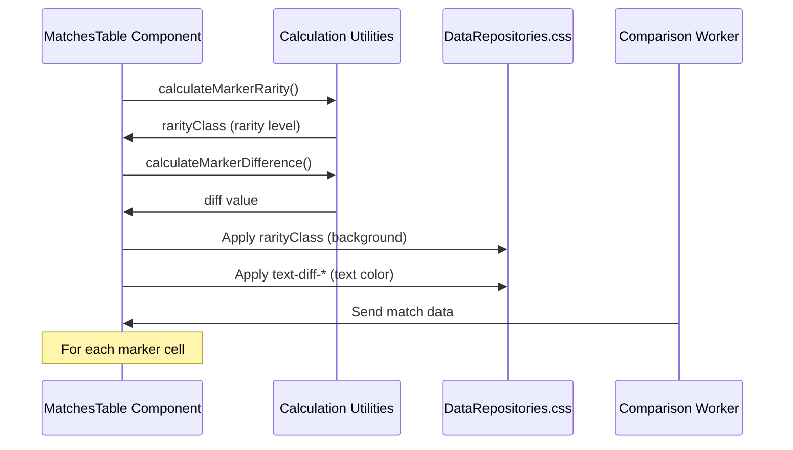

# Marker Highlighting Mechanism Analysis

## Overview
This document details the marker highlighting mechanism in the matches table component (`MatchesTable.tsx`). The system provides visual cues for marker rarity and value differences through CSS classes and color coding.

## Sequence Diagram


## CSS Class System
| Class Name | Rarity Level | Frequency Range | Color |
|------------|--------------|-----------------|-------|
| `marker-rarity-common` | Common | 20-33% | `#fef3f2` (lightest) |
| `marker-rarity-uncommon` | Uncommon | 12-20% | `#fed7cc` |
| `marker-rarity-rare` | Rare | 8-12% | `#fb9b7a` |
| `marker-rarity-very-rare` | Very Rare | 4-8% | `#f97316` |
| `marker-rarity-extremely-rare` | Extremely Rare | <4% | `#dc2626` (darkest) |

## Difference Calculation
```typescript
// From MatchesTable.tsx
const diff = calculateMarkerDifference(
  queryValue,
  matchValue,
  marker,
  marker in palindromes,
  calculationMode
);
```

**Parameters:**
- `queryValue`: Query profile's marker value
- `matchValue`: Match profile's marker value
- `marker`: Marker name (e.g., "DYS389ii")
- `palindromeCheck`: Boolean for palindrome markers
- `calculationMode`: Current comparison mode

## Table Rendering Logic
1. **Rarity Classification** (Lines 318-345):
   ```typescript
   const { rarity, rarityStyle } = calculateMarkerRarity(
     matches, marker, matchValue, queryValue
   );
   ```

2. **CSS Class Assignment** (Lines 568-570):
   ```typescript
   const rarityClass = getRarityClass(marker, matchValue);
   ```

3. **Difference Calculation** (Line 567):
   ```typescript
   const diff = calculateMarkerDifference(...);
   ```

4. **Cell Rendering** (Lines 570-588):
   ```typescript
   <td className={`border ${rarityClass}`}>
     <div className="flex items-center justify-center">
       {diff > 0 && (
         <span className={
           diff === 1 ? 'text-diff-1' :
           diff === 2 ? 'text-diff-2' :
           'text-diff-3'
         }>
           {Number(matchValue) > Number(queryValue) 
             ? `+${diff}` 
             : `-${diff}`}
         </span>
       )}
     </div>
   </td>
   ```

## Visual Examples
**Scenario 1: Common Marker (DYS393)**  
- Background: Light pink (`marker-rarity-common`)
- Text: No difference (value matches query)

**Scenario 2: Rare Marker (DYS635) with +2 difference**  
- Background: Medium orange (`marker-rarity-rare`)
- Text: Blue "+2" (`text-diff-2`)

**Scenario 3: Extremely Rare Marker (DYS385a) with -1 difference**  
- Background: Dark red (`marker-rarity-extremely-rare`)
- Text: Light blue "-1" (`text-diff-1`)

**Scenario 4: Very Rare Marker (YGATAH4) with +3 difference**  
- Background: Orange-red (`marker-rarity-very-rare`)
- Text: Dark blue "+3" (`text-diff-3`)

## Key Files
1. [`MatchesTable.tsx`](str-matcher/src/components/str-matcher/MatchesTable.tsx) - Main table component
2. [`DataRepositories.css`](str-matcher/src/syles/DataRepositories.css) - Style definitions
3. [`useSTRMatcher.ts`](str-matcher/src/hooks/useSTRMatcher.ts) - State management
4. [`comparison.worker.ts`](str-matcher/src/workers/comparison.worker.ts) - Matching logic