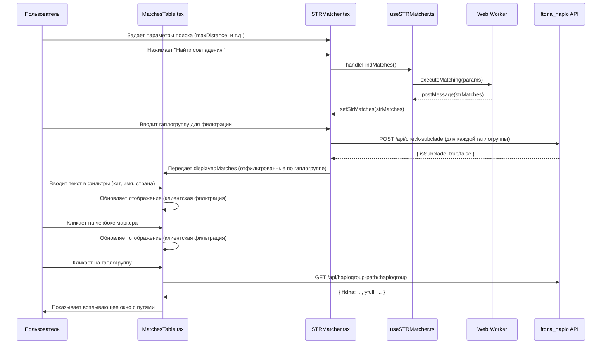

# Анализ взаимодействия ftdna_haplo и str-matcher

Этот документ описывает архитектуру и взаимодействие между бэкенд-сервисом `ftdna_haplo` и фронтенд-приложением `str-matcher`. Основное внимание уделяется механизму фильтрации данных в компоненте `MatchesTable`.

## 1. Обзор архитектуры

Система состоит из двух основных частей:

* **`ftdna_haplo` (бэкенд)**: Сервис на Node.js/Express, который предоставляет API для работы с данными о гаплогруппах из источников FTDNA и YFull.
* **`str-matcher` (фронтенд)**: Приложение на Next.js/React, которое позволяет пользователям загружать свои STR-профили, находить совпадения и гибко фильтровать результаты.

## 2. Анализ бэкенда (`ftdna_haplo`)

Бэкенд отвечает за обработку и предоставление данных о гаплогруппах.

### 2.1. API эндпоинты

Ключевые эндпоинты, определенные в `server.js`:

* `GET /api/search/:haplogroup`: Ищет информацию о гаплогруппе в базах FTDNA и YFull.
* `GET /api/haplogroup-path/:haplogroup`: Возвращает полные пути гаплогруппы из FTDNA и YFull. Используется во всплывающем окне в `MatchesTable`.
* `POST /api/check-subclade`: Проверяет, является ли одна гаплогруппа субкладом другой. Это ключевой эндпоинт для фильтрации по субкладам.
* `GET /api/autocomplete`: Предоставляет варианты для автодополнения при поиске гаплогрупп.

### 2.2. `HaplogroupService`

Вся бизнес-логика инкапсулирована в `HaplogroupService`. Его основные методы:

* `searchHaplogroup(term)`: Ищет гаплогруппу в деревьях FTDNA и YFull. Если находит совпадение только в одной базе, использует `SearchIntegrator` для поиска соответствующей ветви в другой.
* `checkSubclade(haplogroup, parentHaplogroup)`: Последовательно проверяет в деревьях FTDNA и YFull, является ли `haplogroup` субкладом `parentHaplogroup`.

## 3. Анализ фронтенда (`str-matcher`)

Фронтенд обеспечивает пользовательский интерфейс для работы с данными.

### 3.1. Ключевые компоненты и хуки

* **`STRMatcher.tsx`**: Основной компонент-контейнер, который управляет состоянием и взаимодействием дочерних компонентов.
* **`useSTRMatcher.ts`**: Хук, который инкапсулирует логику работы с данными: загрузку профилей, запуск поиска совпадений через Web Worker, управление настройками поиска.
* **`MatchesTable.tsx`**: Компонент, отвечающий за отображение и многоуровневую фильтрацию совпадений.

### 3.2. Механизм фильтрации в `MatchesTable`

Фильтрация происходит в несколько этапов, что обеспечивает высокую производительность и гибкость:

1. **Первичный отбор (Web Worker)**: `useSTRMatcher` запускает Web Worker для выполнения ресурсоемких вычислений генетической дистанции. Это позволяет избежать блокировки основного потока. Worker возвращает предварительный список совпадений (`strMatches`), отфильтрованный по максимальной дистанции и количеству маркеров.

2. **Фильтрация по гаплогруппам (`STRMatcher.tsx`)**:
    * Пользователь вводит искомую гаплогруппу в компоненте `HaplogroupFilter`.
    * Если активирована опция "включая субклады", `STRMatcher` для каждой уникальной гаплогруппы из `strMatches` отправляет запрос на эндпоинт `POST /api/check-subclade`.
    * На основе ответов от бэкенда формируется новый отфильтрованный массив `displayedMatches`.

3. **Интерактивная фильтрация (`MatchesTable.tsx`)**: Компонент `MatchesTable` получает `displayedMatches` и применяет к ним финальные, клиентские фильтры:
    * **Текстовые фильтры**: Поля для ввода номера кита, имени и страны позволяют мгновенно сузить выборку.
    * **Фильтры по маркерам**: Пользователь может кликнуть на чекбокс в заголовке столбца с маркером. Это оставляет в таблице только те профили, у которых значение данного маркера совпадает со значением в профиле запроса.

## 4. Схема взаимодействия

Диаграмма ниже иллюстрирует поток данных и процесс фильтрации.

## 5. Устранение неполадок

В ходе анализа были выявлены и устранены две ключевые проблемы.

### 5.1. Некорректная логика фильтрации субкладов

*   **Проблема**: Логика в методах `isSubclade` на бэкенде была неточной, что приводило к некорректной фильтрации по вложенным веткам.
*   **Решение**: Логика была унифицирована и исправлена. Теперь для определения отношения "субклад" используется строгая проверка, является ли путь родительской гаплогруппы начальным сегментом пути дочерней, что гарантирует корректность иерархии.

### 5.2. Сетевая ошибка (Network Error) при фильтрации

*   **Проблема**: Фронтенд-приложение не могло связаться с API бэкенда из-за отсутствия настроек прокси и неправильного URL для запросов.
*   **Решение**:
    1.  В `next.config.js` добавлено правило `rewrites`, которое перенаправляет все запросы `/api/*` на бэкенд-сервер `http://localhost:9003`.
    2.  В хуке `useHaplogroups.ts` URL для API-запросов был изменен на относительный (`/api`), чтобы запросы корректно обрабатывались через прокси Next.js.
