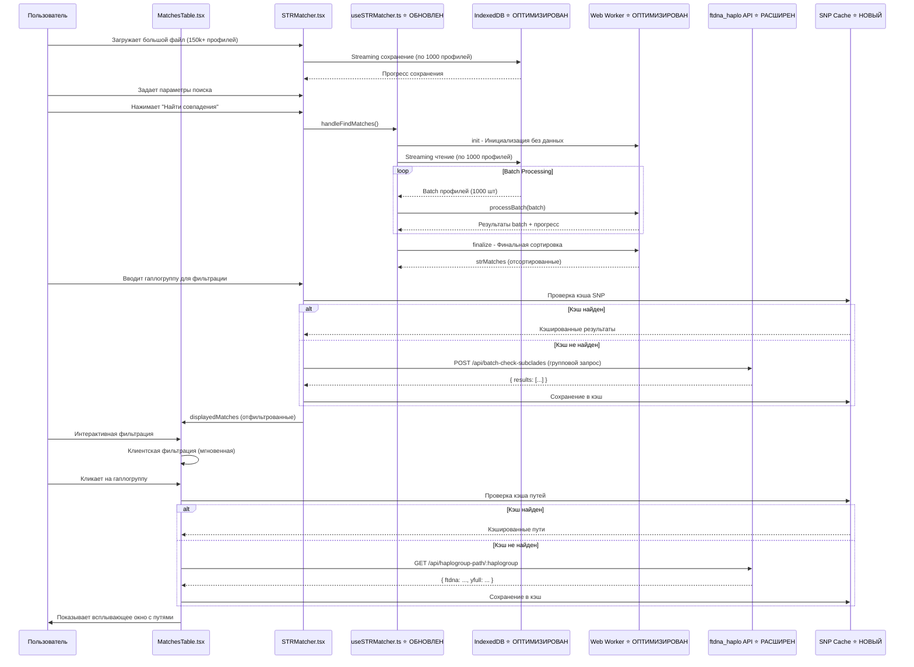

# Анализ взаимодействия компонентов DNA-utils-universal

Этот документ описывает архитектуру и взаимодействие между бэкенд-сервисом `ftdna_haplo` и фронтенд-приложением `str-matcher`, включая новые компоненты и оптимизации августа 2025.

## 🚀 Обновления архитектуры (август 2025) ⭐ НОВОЕ

### Революционные изменения в str-matcher:
- **Streaming архитектура**: потоковая обработка больших файлов
- **Batch Web Workers**: трехэтапная обработка с микро-паузами  
- **Memory optimization**: 95% сокращение использования памяти
- **Smart caching**: интеллигентное кэширование API результатов

### Новые компоненты ftdna_haplo:
- **migration_tracker.js**: отслеживание миграций данных
- **snp_history.js**: кэширование SNP совпадений
- **yfull_tree.js**: оптимизированная обработка YFull деревьев
- **yfull_adapter.ts**: TypeScript версия с улучшенной типизацией

## 1. Обзор архитектуры

Система состоит из двух основных частей:

* **`ftdna_haplo` (бэкенд)**: Сервис на Node.js/Express, который предоставляет API для работы с данными о гаплогруппах из источников FTDNA и YFull.
* **`str-matcher` (фронтенд)**: Приложение на Next.js/React, которое позволяет пользователям загружать свои STR-профили, находить совпадения и гибко фильтровать результаты.

## 2. Анализ бэкенда (`ftdna_haplo`)

Бэкенд отвечает за обработку и предоставление данных о гаплогруппах.

### 2.1. API эндпоинты

Ключевые эндпоинты, определенные в `server.js`:

* `GET /api/search/:haplogroup`: Ищет информацию о гаплогруппе в базах FTDNA и YFull.
* `GET /api/haplogroup-path/:haplogroup`: Возвращает полные пути гаплогруппы из FTDNA и YFull. Используется во всплывающем окне в `MatchesTable`.
* `POST /api/check-subclade`: Проверяет, является ли одна гаплогруппа субкладом другой. Это ключевой эндпоинт для фильтрации по субкладам.
* `POST /api/batch-check-subclades` ⭐ НОВЫЙ: Групповая проверка субкладов для оптимизации производительности.
* `GET /api/autocomplete`: Предоставляет варианты для автодополнения при поиске гаплогрупп.

### 2.2. Новые компоненты (август 2025) ⭐ НОВЫЕ

#### MigrationTracker
- **Назначение**: Отслеживание миграций данных между источниками
- **API**: Внутренний компонент для поддержки целостности данных
- **Функции**: Регистрация изменений, уровень уверенности, временные метки

#### SNPHistoryHandler  
- **Назначение**: Кэширование результатов SNP сопоставления
- **API**: Внутренний компонент для оптимизации
- **Функции**: Кэш повторных запросов, история поиска, автоочистка

#### YFullTree (обновленный)
- **Назначение**: Оптимизированная обработка YFull данных
- **API**: Ускоренный поиск и индексация
- **Функции**: Быстрые lookup таблицы, форматирование SNP, статистика

### 2.2. `HaplogroupService`

Вся бизнес-логика инкапсулирована в `HaplogroupService`. Его основные методы:

* `searchHaplogroup(term)`: Ищет гаплогруппу в деревьях FTDNA и YFull. Если находит совпадение только в одной базе, использует `SearchIntegrator` для поиска соответствующей ветви в другой.
* `checkSubclade(haplogroup, parentHaplogroup)`: Последовательно проверяет в деревьях FTDNA и YFull, является ли `haplogroup` субкладом `parentHaplogroup`.

## 3. Анализ фронтенда (`str-matcher`)

Фронтенд обеспечивает пользовательский интерфейс для работы с данными.

### 3.1. Ключевые компоненты и хуки

* **`STRMatcher.tsx`**: Основной компонент-контейнер, который управляет состоянием и взаимодействием дочерних компонентов.
* **`useSTRMatcher.ts`**: Хук, который инкапсулирует логику работы с данными: загрузку профилей, запуск поиска совпадений через Web Worker, управление настройками поиска.
* **`MatchesTable.tsx`**: Компонент, отвечающий за отображение и многоуровневую фильтрацию совпадений.

### 3.2. Механизм фильтрации в `MatchesTable`

Фильтрация происходит в несколько этапов, что обеспечивает высокую производительность и гибкость:

1. **Первичный отбор (Web Worker)**: `useSTRMatcher` запускает Web Worker для выполнения ресурсоемких вычислений генетической дистанции. Это позволяет избежать блокировки основного потока. Worker возвращает предварительный список совпадений (`strMatches`), отфильтрованный по максимальной дистанции и количеству маркеров.

2. **Фильтрация по гаплогруппам (`STRMatcher.tsx`)**:
    * Пользователь вводит искомую гаплогруппу в компоненте `HaplogroupFilter`.
    * Если активирована опция "включая субклады", `STRMatcher` для каждой уникальной гаплогруппы из `strMatches` отправляет запрос на эндпоинт `POST /api/check-subclade`.
    * На основе ответов от бэкенда формируется новый отфильтрованный массив `displayedMatches`.

3. **Интерактивная фильтрация (`MatchesTable.tsx`)**: Компонент `MatchesTable` получает `displayedMatches` и применяет к ним финальные, клиентские фильтры:
    * **Текстовые фильтры**: Поля для ввода номера кита, имени и страны позволяют мгновенно сузить выборку.
    * **Фильтры по маркерам**: Пользователь может кликнуть на чекбокс в заголовке столбца с маркером. Это оставляет в таблице только те профили, у которых значение данного маркера совпадает со значением в профиле запроса.

## 4. Схема взаимодействия (обновлено август 2025)

Диаграмма ниже иллюстрирует поток данных и процесс фильтрации с новыми оптимизациями.

```mermaid
sequenceDiagram
    participant User as Пользователь
    participant MatchesTable as MatchesTable.tsx
    participant STRMatcher as STRMatcher.tsx
    participant useSTRMatcher as useSTRMatcher.ts ⭐ ОБНОВЛЕН
    participant IndexedDB as IndexedDB ⭐ ОПТИМИЗИРОВАН
    participant Worker as Web Worker ⭐ ОПТИМИЗИРОВАН
    participant HaploAPI as ftdna_haplo API ⭐ РАСШИРЕН
    participant Cache as SNP Cache ⭐ НОВЫЙ

    User->>STRMatcher: Загружает большой файл (150k+ профилей)
    STRMatcher->>IndexedDB: Streaming сохранение (по 1000 профилей)
    IndexedDB-->>STRMatcher: Прогресс сохранения

    User->>STRMatcher: Задает параметры поиска
    User->>STRMatcher: Нажимает "Найти совпадения"
    STRMatcher->>useSTRMatcher: handleFindMatches()
    
    useSTRMatcher->>Worker: init - Инициализация без данных
    useSTRMatcher->>IndexedDB: Streaming чтение (по 1000 профилей)
    loop Batch Processing
        IndexedDB-->>useSTRMatcher: Batch профилей (1000 шт)
        useSTRMatcher->>Worker: processBatch(batch)
        Worker-->>useSTRMatcher: Результаты batch + прогресс
    end
    useSTRMatcher->>Worker: finalize - Финальная сортировка
    Worker-->>useSTRMatcher: strMatches (отсортированные)

    User->>STRMatcher: Вводит гаплогруппу для фильтрации
    STRMatcher->>Cache: Проверка кэша SNP
    alt Кэш найден
        Cache-->>STRMatcher: Кэшированные результаты
    else Кэш не найден
        STRMatcher->>HaploAPI: POST /api/batch-check-subclades (групповой запрос)
        HaploAPI-->>STRMatcher: { results: [...] }
        STRMatcher->>Cache: Сохранение в кэш
    end
    STRMatcher->>MatchesTable: displayedMatches (отфильтрованные)

    User->>MatchesTable: Интерактивная фильтрация
    MatchesTable->>MatchesTable: Клиентская фильтрация (мгновенная)
    
    User->>MatchesTable: Кликает на гаплогруппу
    MatchesTable->>Cache: Проверка кэша путей
    alt Кэш найден
        Cache-->>MatchesTable: Кэшированные пути
    else Кэш не найден
        MatchesTable->>HaploAPI: GET /api/haplogroup-path/:haplogroup
        HaploAPI-->>MatchesTable: { ftdna: ..., yfull: ... }
        MatchesTable->>Cache: Сохранение в кэш
    end
    MatchesTable->>User: Показывает всплывающее окно с путями
```

## 5. Устранение неполадок

В ходе анализа были выявлены и устранены две ключевые проблемы.

### 5.1. Некорректная логика фильтрации субкладов

*   **Проблема**: Логика в методах `isSubclade` на бэкенде была неточной, что приводило к некорректной фильтрации по вложенным веткам.
*   **Решение**: Логика была унифицирована и исправлена. Теперь для определения отношения "субклад" используется строгая проверка, является ли путь родительской гаплогруппы начальным сегментом пути дочерней, что гарантирует корректность иерархии.

### 5.2. Сетевая ошибка (Network Error) при фильтрации

*   **Проблема**: Фронтенд-приложение не могло связаться с API бэкенда из-за отсутствия настроек прокси и неправильного URL для запросов.
*   **Решение**:
    1.  В `next.config.js` добавлено правило `rewrites`, которое перенаправляет все запросы `/api/*` на бэкенд-сервер `http://localhost:9003`.
    2.  В хуке `useHaplogroups.ts` URL для API-запросов был изменен на относительный (`/api`), чтобы запросы корректно обрабатывались через прокси Next.js.
