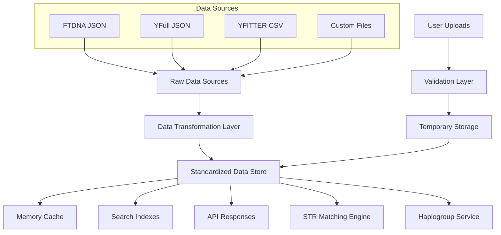

# 🗄️ Структуры данных DNA-utils-universal

## 📋 Обзор

Система DNA-utils-universal использует файловые хранилища данных в формате JSON и специализированные структуры для эффективной работы с генетическими данными. Данный документ описывает все структуры данных, их назначение и взаимосвязи.

## 🏗️ Архитектура данных



## 📊 Основные структуры данных

### 1. Repository Structure (Репозиторий)

```typescript
interface Repository {
  name: string;                    // Уникальное имя источника
  description: string;             // Описание источника данных
  url?: string;                    // URL для загрузки (null для пользовательских)
  type: 'json' | 'csv';           // Тип исходных данных
  enabled: boolean;                // Активен ли источник
  priority: number;                // Приоритет загрузки (1-10)
  metadata: RepositoryMetadata;    // Метаданные источника
  data: ProcessedEntry[];          // Обработанные данные
  filters?: RepositoryFilters;     // Фильтры по умолчанию
  transform?: TransformFunction;   // Функция трансформации
}

interface RepositoryMetadata {
  lastUpdated: string;            // ISO дата последнего обновления
  recordCount: number;            // Количество записей
  qualityScore: number;           // Оценка качества данных (0-100)
  source: string;                 // Оригинальный источник
  version?: string;               // Версия данных
  region?: string;                // Географический регион
  loadTime: number;               // Время загрузки в мс
  fileSize: number;               // Размер файла в байтах
}

interface RepositoryFilters {
  haplogroups?: string[];         // Разрешенные гаплогруппы
  regions?: string[];             // Разрешенные регионы
  quality?: ('high' | 'medium' | 'low')[];
  markers?: string[];             // Обязательные маркеры
  dateRange?: [Date, Date];       // Диапазон дат
}
```

### 2. Processed Entry (Обработанная запись)

```typescript
interface ProcessedEntry {
  name: string;                   // Уникальный идентификатор
  haplogroup: string;             // Гаплогруппа Y-хромосомы
  markers: MarkerSet;             // Набор Y-STR маркеров
  metadata: EntryMetadata;        // Метаданные записи
  computed?: ComputedData;        // Вычисленные данные
}

interface MarkerSet {
  // Стандартные маркеры (всегда строки)
  [markerName: string]: string;
  
  // Примеры:
  DYS393: string;                 // "13"
  DYS390: string;                 // "24"
  DYS19: string;                  // "14" 
  DYS391: string;                 // "11"
  DYS385: string;                 // "11-14" (палиндромный)
  DYS459: string;                 // "9-10" (палиндромный)
  // ... другие маркеры
}

interface EntryMetadata {
  source: string;                 // Источник данных
  quality: 'high' | 'medium' | 'low';
  region?: string;                // Географический регион
  updated: string;                // Дата обновления (ISO)
  confidence?: number;            // Уровень достоверности (0-1)
  kitNumber?: string;             // Номер кита (для FTDNA)
  sampleId?: string;              // ID образца (для YFull)
  ancestralPath?: string[];       // Путь предков гаплогруппы
}

interface ComputedData {
  markerCount: number;            // Количество доступных маркеров
  normalizedMarkers: NormalizedMarkerSet;
  haplogroupLevel: number;        // Уровень детализации гаплогруппы
  searchIndex: string[];          // Индекс для поиска
}
```

### 3. Normalized Marker Set (Нормализованные маркеры)

```typescript
interface NormalizedMarkerSet {
  [markerName: string]: MarkerValue;
}

interface MarkerValue {
  raw: string;                    // Исходное значение
  values: number[];               // Числовые значения
  isPalindromic: boolean;         // Палиндромный маркер
  isValid: boolean;               // Валидность значения
  metadata?: MarkerMetadata;
}

interface MarkerMetadata {
  mutationRate?: number;          // Скорость мутации
  repeatUnit?: string;            // Повторяющееся звено
  chromosome?: string;            // Локация на хромосоме
  aliases?: string[];             // Альтернативные названия
}

// Пример нормализованного маркера
const exampleMarker: MarkerValue = {
  raw: "11-14",
  values: [11, 14],
  isPalindromic: true,
  isValid: true,
  metadata: {
    mutationRate: 0.002,
    repeatUnit: "GATA",
    chromosome: "Y",
    aliases: ["DYS385a/b"]
  }
};
```

## 🔢 STR Distance Calculation (Расчет генетических дистанций)

### Distance Calculation Request

```typescript
interface DistanceCalculationRequest {
  userMarkers: MarkerSet;         // Маркеры пользователя
  targetEntries: ProcessedEntry[]; // Целевые записи для сравнения
  method: DistanceMethod;         // Метод расчета дистанции
  options?: DistanceOptions;      // Дополнительные параметры
}

type DistanceMethod = 
  | 'simple'                      // Простое совпадение
  | 'weighted'                    // Взвешенное по скорости мутации
  | 'genetic';                    // Генетическое расстояние

interface DistanceOptions {
  maxDistance?: number;           // Максимальная дистанция для фильтрации
  includePartialMatches?: boolean; // Включать частичные совпадения
  normalizePalindromic?: boolean; // Нормализовать палиндромные маркеры
  mutationRates?: MutationRateMap; // Пользовательские скорости мутации
}

interface MutationRateMap {
  [markerName: string]: number;
}
```

### Distance Result

```typescript
interface DistanceResult {
  target: ProcessedEntry;         // Целевая запись
  distance: number;               // Генетическая дистанция
  matchedMarkers: number;         // Количество совпавших маркеров
  totalMarkers: number;           // Общее количество сравненных маркеров
  details: DistanceDetails;       // Детали расчета
  metadata: DistanceMetadata;     // Метаданные результата
}

interface DistanceDetails {
  markerComparisons: MarkerComparison[]; // Сравнения по маркерам
  method: DistanceMethod;         // Использованный метод
  partialMatches: number;         // Частичные совпадения
  missingMarkers: string[];       // Отсутствующие маркеры
}

interface MarkerComparison {
  marker: string;                 // Название маркера
  userValue: MarkerValue;         // Значение пользователя
  targetValue: MarkerValue;       // Значение цели
  distance: number;               // Дистанция по данному маркеру
  weight?: number;                // Вес маркера (для weighted метода)
}

interface DistanceMetadata {
  calculationTime: number;        // Время расчета в мс
  accuracy: 'high' | 'medium' | 'low'; // Точность расчета
  warnings?: string[];            // Предупреждения
}
```

## 🧬 Haplogroup Structure (Структура гаплогрупп)

### Haplogroup Tree Node

```typescript
interface HaplogroupTreeNode {
  name: string;                   // Название гаплогруппы (R-M269)
  parent?: string;                // Родительская гаплогруппа
  children: string[];             // Дочерние гаплогруппы
  level: number;                  // Уровень в дереве (0 = корень)
  snps: SNP[];                   // Связанные SNP мутации
  metadata: HaplogroupMetadata;   // Метаданные гаплогруппы
}

interface SNP {
  name: string;                   // Название SNP (M269)
  position?: number;              // Позиция на хромосоме
  mutation?: string;              // Тип мутации (C>T)
  quality?: 'confirmed' | 'predicted' | 'tentative';
}

interface HaplogroupMetadata {
  estimatedAge?: number;          // Возраст в годах
  region?: string;                // Основной географический регион
  frequency?: number;             // Частота в популяции (0-1)
  source: 'FTDNA' | 'YFull' | 'ISOGG' | 'custom';
  lastUpdated: string;            // Дата последнего обновления
  alternativeNames?: string[];    // Альтернативные названия
}
```

### Haplogroup Check Request/Response

```typescript
interface HaplogroupCheckRequest {
  parentHaplogroup: string;       // Родительская гаплогруппа
  childHaplogroup: string;        // Проверяемая дочерняя
  source?: 'FTDNA' | 'YFull';    // Источник данных для проверки
}

interface HaplogroupCheckResponse {
  isSubclade: boolean;            // Является ли субкладом
  confidence: number;             // Уверенность в результате (0-1)
  path?: string[];                // Путь от родителя к потомку
  details: CheckDetails;          // Детали проверки
}

interface CheckDetails {
  method: 'direct' | 'inferred';  // Метод определения
  intermediateNodes?: string[];   // Промежуточные узлы
  source: string;                 // Источник данных
  warnings?: string[];            // Предупреждения
}
```

## 💾 Cache Structure (Структура кэша)

### Memory Cache

```typescript
interface MemoryCache {
  repositories: Map<string, CachedRepository>;
  distances: Map<string, CachedDistanceResult>;
  haplogroups: Map<string, CachedHaplogroupData>;
  indexes: Map<string, SearchIndex>;
  stats: CacheStats;
}

interface CachedRepository {
  data: ProcessedEntry[];
  timestamp: number;              // Время кэширования
  ttl: number;                    // Время жизни в мс
  hits: number;                   // Количество обращений
  size: number;                   // Размер в байтах
}

interface CachedDistanceResult {
  key: string;                    // Хэш от параметров запроса
  result: DistanceResult[];
  timestamp: number;
  ttl: number;
}

interface CacheStats {
  totalSize: number;              // Общий размер кэша
  hitRate: number;                // Коэффициент попаданий
  evictions: number;              // Количество вытеснений
  lastCleanup: number;            // Время последней очистки
}
```

### Disk Cache

```typescript
interface DiskCacheEntry {
  key: string;                    // Ключ кэша
  data: any;                      // Кэшированные данные
  metadata: DiskCacheMetadata;
}

interface DiskCacheMetadata {
  created: number;                // Время создания
  lastAccessed: number;           // Последнее обращение
  accessCount: number;            // Количество обращений
  size: number;                   // Размер в байтах
  ttl: number;                    // Время жизни
  checksum?: string;              // Контрольная сумма для валидации
}
```

## 🔍 Search Index Structure (Структура поискового индекса)

### Search Index

```typescript
interface SearchIndex {
  byName: Map<string, ProcessedEntry>;      // Индекс по имени
  byHaplogroup: Map<string, ProcessedEntry[]>; // Индекс по гаплогруппе
  byMarker: Map<string, MarkerIndex>;       // Индекс по маркерам
  byRegion: Map<string, ProcessedEntry[]>;  // Индекс по регионам
  textSearch: TextSearchIndex;              // Полнотекстовый поиск
  metadata: SearchIndexMetadata;
}

interface MarkerIndex {
  marker: string;                 // Название маркера
  values: Map<string, ProcessedEntry[]>; // Значение -> записи
  statistics: MarkerStatistics;   // Статистика по маркеру
}

interface MarkerStatistics {
  totalEntries: number;           // Общее количество записей
  uniqueValues: number;           // Уникальных значений
  mostCommon: string;             // Самое частое значение
  distribution: Map<string, number>; // Распределение значений
}

interface TextSearchIndex {
  // Инвертированный индекс для полнотекстового поиска
  tokens: Map<string, Set<string>>; // токен -> множество ID записей
  stemming: Map<string, string>;    // основа слова -> токен
  fuzzyMatches: Map<string, string[]>; // слово -> похожие слова
}

interface SearchIndexMetadata {
  created: number;                // Время создания
  totalEntries: number;           // Общее количество записей
  indexSize: number;              // Размер индекса в байтах
  buildTime: number;              // Время построения в мс
  version: string;                // Версия структуры индекса
}
```

## 🔧 Configuration Structures (Структуры конфигурации)

### Application Configuration

```typescript
interface AppConfiguration {
  server: ServerConfig;
  database: DatabaseConfig;
  cache: CacheConfig;
  api: APIConfig;
  logging: LoggingConfig;
  performance: PerformanceConfig;
}

interface ServerConfig {
  port: number;
  host: string;
  cors: CORSConfig;
  rateLimit: RateLimitConfig;
  ssl?: SSLConfig;
}

interface DatabaseConfig {
  repositories: Repository[];
  autoUpdate: boolean;
  updateInterval: number;         // Интервал обновления в мс
  backupInterval: number;         // Интервал резервного копирования
  maxFileSize: number;            // Максимальный размер файла
}

interface CacheConfig {
  memory: {
    maxSize: number;              // Максимальный размер в байтах
    ttl: number;                  // TTL по умолчанию
    strategy: 'LRU' | 'LFU' | 'FIFO';
  };
  disk: {
    path: string;                 // Путь к кэшу на диске
    maxSize: number;
    cleanupInterval: number;
  };
}

interface APIConfig {
  timeout: number;                // Таймаут запросов
  maxPayloadSize: string;         // Максимальный размер payload
  pagination: {
    defaultLimit: number;
    maxLimit: number;
  };
  validation: {
    strict: boolean;              // Строгая валидация
    sanitize: boolean;            // Санитизация входных данных
  };
}
```

## 📊 Statistics Structure (Структура статистики)

### Usage Statistics

```typescript
interface UsageStatistics {
  requests: RequestStatistics;
  data: DataStatistics;
  performance: PerformanceStatistics;
  errors: ErrorStatistics;
  timestamp: number;
}

interface RequestStatistics {
  total: number;                  // Общее количество запросов
  byEndpoint: Map<string, number>; // Статистика по эндпоинтам
  byMethod: Map<string, number>;  // Статистика по HTTP методам
  responseTimeP95: number;        // 95-й процентиль времени ответа
  successRate: number;            // Коэффициент успешных запросов
}

interface DataStatistics {
  repositoriesLoaded: number;     // Загруженных репозиториев
  totalRecords: number;           // Общее количество записей
  uniqueHaplogroups: number;      // Уникальных гаплогрупп
  averageMarkersPerRecord: number; // Среднее количество маркеров
  dataQualityScore: number;       // Общая оценка качества данных
  lastDataUpdate: number;         // Время последнего обновления
}

interface PerformanceStatistics {
  memoryUsage: MemoryUsage;
  cacheHitRate: number;           // Коэффициент попаданий в кэш
  averageDistanceCalcTime: number; // Среднее время расчета дистанции
  indexBuildTime: number;         // Время построения индексов
  diskUsage: DiskUsage;
}

interface MemoryUsage {
  used: number;                   // Используемая память в байтах
  total: number;                  // Общая память
  heapUsed: number;               // Используемая heap память
  external: number;               // Внешняя память
}

interface DiskUsage {
  dataSize: number;               // Размер данных
  cacheSize: number;              // Размер кэша
  logSize: number;                // Размер логов
  totalSize: number;              // Общий размер
}

interface ErrorStatistics {
  total: number;                  // Общее количество ошибок
  byType: Map<string, number>;    // По типам ошибок
  byEndpoint: Map<string, number>; // По эндпоинтам
  recent: ErrorRecord[];          // Недавние ошибки
}

interface ErrorRecord {
  timestamp: number;
  type: string;
  message: string;
  endpoint?: string;
  stack?: string;
}
```

## 🔄 Data Transformation (Трансформация данных)

### Transform Function Types

```typescript
type TransformFunction = (rawData: any) => ProcessedEntry[];

interface TransformContext {
  repository: Repository;
  options: TransformOptions;
  metadata: TransformMetadata;
}

interface TransformOptions {
  validateInput: boolean;         // Валидировать входные данные
  normalizeMarkers: boolean;      // Нормализовать маркеры
  inferMetadata: boolean;         // Выводить метаданные
  strict: boolean;                // Строгий режим
}

interface TransformMetadata {
  sourceFormat: string;           // Формат исходных данных
  transformedAt: number;          // Время трансформации
  recordsProcessed: number;       // Обработано записей
  recordsSkipped: number;         // Пропущено записей
  errors: TransformError[];       // Ошибки трансформации
}

interface TransformError {
  recordIndex: number;            // Индекс записи с ошибкой
  field?: string;                 // Поле с ошибкой
  error: string;                  // Описание ошибки
  severity: 'warning' | 'error';  // Серьезность
}
```

## 🧪 Validation Schemas (Схемы валидации)

### JSON Schema для валидации данных

```typescript
const ProcessedEntrySchema = {
  type: "object",
  required: ["name", "haplogroup", "markers"],
  properties: {
    name: {
      type: "string",
      minLength: 1,
      maxLength: 100,
      pattern: "^[A-Za-z0-9_-]+$"
    },
    haplogroup: {
      type: "string",
      pattern: "^[A-Z]-[A-Z0-9]+.*$"
    },
    markers: {
      type: "object",
      patternProperties: {
        "^DYS[0-9]+$|^CDY[ab]$": {
          type: "string",
          pattern: "^[0-9]+(-[0-9]+)*$"
        }
      },
      additionalProperties: false,
      minProperties: 1
    },
    metadata: {
      type: "object",
      required: ["source", "quality", "updated"],
      properties: {
        source: { type: "string" },
        quality: { enum: ["high", "medium", "low"] },
        region: { type: "string" },
        updated: { type: "string", format: "date-time" }
      }
    }
  }
};
```

## 🔗 Связанные документы

- [Архитектура системы](../ARCHITECTURE.md)
- [API справочник](../API_REFERENCE.md) 
- [Алгоритмы расчетов](algorithms.md)
- [Работа с источниками данных](../guides/data-sources.md)
- [Оптимизация производительности](performance.md)
