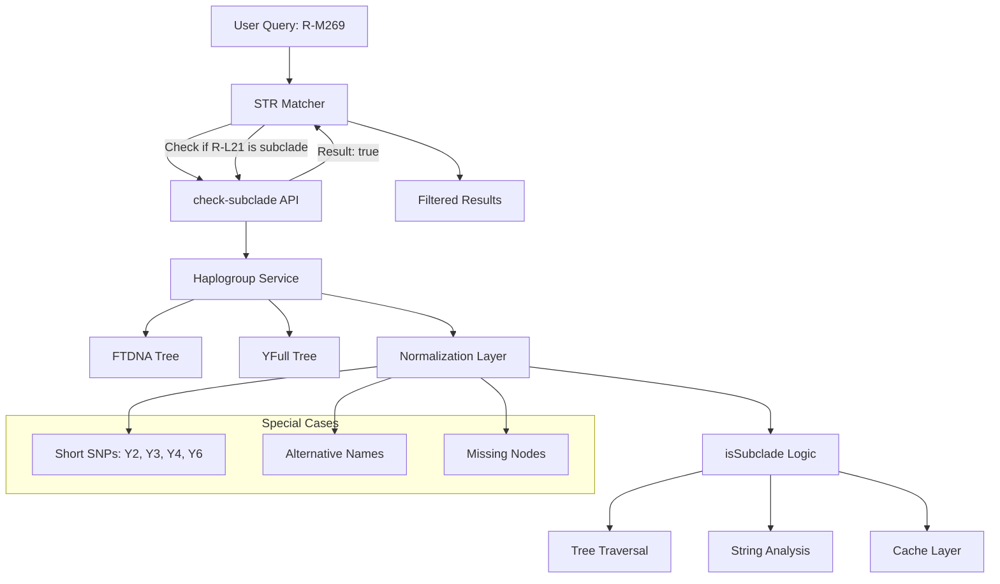

# 🧬 Логика фильтрации гаплогрупп DNA-utils-universal

## 📋 Обзор

Фильтрация гаплогрупп - одна из самых критических и сложных частей системы DNA-utils-universal. Она обеспечивает корректное определение филогенетических связей между Y-хромосомными гаплогруппами, используя данные из FTDNA и YFull деревьев.

## ⚠️ КРИТИЧЕСКИ ВАЖНО

### Ключевые принципы:
1. **НЕ просто строковое сравнение** - фильтрация основана на филогенетической вложенности
2. **check-subclade API** - центральный эндпоинт для всех проверок субкладов
3. **Короткие SNP** (R-Y6, Y4, Y2, Y3) требуют специальной обработки
4. **Интеграция STR Matcher ↔ FTDNA Haplo** - любые изменения могут сломать взаимодействие
5. **Два источника данных** - FTDNA и YFull с разными структурами деревьев

## 🏗️ Архитектура фильтрации



## 🔗 Интеграция STR Matcher ↔ FTDNA Haplo

### Критический эндпоинт: check-subclade

```javascript
// ftdna_haplo/server/server.js - ЦЕНТРАЛЬНЫЙ API
app.post('/api/check-subclade', async (req, res) => {
  try {
    const { haplogroup, subclade, source = 'FTDNA' } = req.body;
    
    if (!haplogroup || !subclade) {
      return res.status(400).json({ 
        error: 'Требуются параметры haplogroup и subclade' 
      });
    }
    
    console.log(`🔍 Проверка субклада: ${subclade} является субкладом ${haplogroup}? (источник: ${source})`);
    
    const result = await haplogroupService.isSubclade(haplogroup, subclade, source);
    
    res.json({
      isSubclade: result.isSubclade,
      confidence: result.confidence,
      method: result.method,
      path: result.path,
      source: source,
      timestamp: Date.now()
    });
    
  } catch (error) {
    console.error('❌ Ошибка check-subclade:', error);
    res.status(500).json({ 
      error: 'Внутренняя ошибка сервера',
      details: error.message 
    });
  }
});
```

### Использование в STR Matcher

```javascript
// str-matcher/src/components/str-matcher/STRMatcher.tsx
async function filterByHaplogroup(matches, targetHaplogroup) {
  if (!targetHaplogroup || targetHaplogroup === 'all') {
    return matches;
  }
  
  const filteredMatches = [];
  
  for (const match of matches) {
    try {
      // КРИТИЧЕСКИЙ ЗАПРОС к FTDNA Haplo API
      const response = await fetch('/api/haplo/check-subclade', {
        method: 'POST',
        headers: {
          'Content-Type': 'application/json',
        },
        body: JSON.stringify({
          haplogroup: targetHaplogroup,
          subclade: match.target.haplogroup,
          source: 'FTDNA'
        })
      });
      
      if (!response.ok) {
        console.warn(`⚠️ Ошибка проверки субклада для ${match.target.haplogroup}`);
        continue;
      }
      
      const result = await response.json();
      
      if (result.isSubclade) {
        filteredMatches.push({
          ...match,
          haplogroupMatch: {
            isSubclade: true,
            confidence: result.confidence,
            method: result.method,
            path: result.path
          }
        });
      }
      
    } catch (error) {
      console.error(`❌ Ошибка фильтрации гаплогрупп:`, error);
      // В случае ошибки включаем в результаты (fail-safe)
      filteredMatches.push(match);
    }
  }
  
  console.log(`🔍 Фильтрация по ${targetHaplogroup}: ${matches.length} -> ${filteredMatches.length}`);
  return filteredMatches;
}
```

## 🌳 Структуры деревьев гаплогрупп

### FTDNA Tree Structure

```javascript
// ftdna_haplo/haplo_functions.js - ОСНОВНОЕ ДЕРЕВО
const haplogroupTree = {
  'R': {
    name: 'R',
    parent: null,
    children: ['R-M173', 'R-M479'],
    level: 0,
    snps: ['R']
  },
  'R-M269': {
    name: 'R-M269',
    parent: 'R-P311',
    children: ['R-L21', 'R-L151', 'R-U152', 'R-L23*'],
    level: 3,
    snps: ['M269'],
    metadata: {
      estimatedAge: 4500,
      region: 'Europe'
    }
  },
  'R-L21': {
    name: 'R-L21',
    parent: 'R-M269',
    children: ['R-M222', 'R-L513', 'R-DF21*'],
    level: 4,
    snps: ['L21', 'M529', 'S145'],
    metadata: {
      estimatedAge: 4000,
      region: 'Celtic'
    }
  },
  // ... тысячи других узлов
};

// Функция для получения всех потомков
function getAllDescendants(haplogroup, tree = haplogroupTree) {
  const descendants = [];
  const node = tree[haplogroup];
  
  if (!node) return descendants;
  
  function traverse(nodeName) {
    const currentNode = tree[nodeName];
    if (!currentNode) return;
    
    for (const child of currentNode.children) {
      descendants.push(child);
      traverse(child);
    }
  }
  
  traverse(haplogroup);
  return descendants;
}
```

### YFull Tree Adapter

```javascript
// ftdna_haplo/yfull_adapter.js - АДАПТЕР ДЛЯ YFULL
class YFullTreeAdapter {
  constructor(yfullData) {
    this.rawData = yfullData;
    this.normalizedTree = this.buildNormalizedTree();
  }
  
  buildNormalizedTree() {
    const tree = {};
    
    for (const entry of this.rawData) {
      const haplogroup = this.normalizeYFullHaplogroup(entry.haplogroup);
      
      tree[haplogroup] = {
        name: haplogroup,
        parent: this.findYFullParent(entry),
        children: [],
        level: entry.level || 0,
        snps: this.extractYFullSNPs(entry),
        metadata: {
          yfullId: entry.id,
          samples: entry.samples || 0,
          estimatedAge: entry.tmrca,
          quality: entry.quality || 'medium'
        }
      };
    }
    
    // Устанавливаем связи parent-child
    this.establishYFullRelationships(tree);
    
    return tree;
  }
  
  normalizeYFullHaplogroup(haplogroup) {
    // YFull использует немного другую номенклатуру
    let normalized = haplogroup.trim();
    
    // Конвертируем YFull формат в FTDNA формат
    const yfullToFtdnaMap = {
      'R1b1a1a2a1a2c1a1a1a1a1': 'R-L21',
      'R1b1a1a2a1a2c1': 'R-M269',
      // ... другие маппинги
    };
    
    if (yfullToFtdnaMap[normalized]) {
      normalized = yfullToFtdnaMap[normalized];
    }
    
    return normalized;
  }
  
  isSubclade(parent, child) {
    // Реализация для YFull дерева
    return this.traverseYFullTree(parent, child);
  }
}
```

## 🔍 Логика определения субкладов

### Основная функция isSubclade

```javascript
// ftdna_haplo/server/services/haplogroup-service.js - ОСНОВНАЯ ЛОГИКА
class HaplogroupService {
  constructor() {
    this.ftdnaTree = haplogroupTree;
    this.yfullAdapter = new YFullTreeAdapter(yfullData);
    this.cache = new Map();
  }
  
  async isSubclade(parentHaplogroup, childHaplogroup, source = 'FTDNA') {
    const cacheKey = `${parentHaplogroup}|${childHaplogroup}|${source}`;
    
    // Проверяем кэш
    if (this.cache.has(cacheKey)) {
      const cached = this.cache.get(cacheKey);
      console.log(`📋 Из кэша: ${childHaplogroup} -> ${parentHaplogroup} = ${cached.isSubclade}`);
      return cached;
    }
    
    // Нормализуем входные данные
    const normalizedParent = this.normalizeHaplogroup(parentHaplogroup);
    const normalizedChild = this.normalizeHaplogroup(childHaplogroup);
    
    console.log(`🔍 Проверка: "${normalizedChild}" является субкладом "${normalizedParent}"?`);
    
    let result;
    
    // 1. Быстрая проверка на идентичность
    if (normalizedParent === normalizedChild) {
      result = {
        isSubclade: true,
        confidence: 1.0,
        method: 'identical',
        path: [normalizedParent]
      };
    }
    // 2. Проверка через дерево
    else if (source === 'FTDNA') {
      result = this.checkInFTDNATree(normalizedParent, normalizedChild);
    }
    else if (source === 'YFull') {
      result = this.checkInYFullTree(normalizedParent, normalizedChild);
    }
    // 3. Fallback - анализ строк
    else {
      result = this.inferFromNaming(normalizedParent, normalizedChild);
    }
    
    // Кэшируем результат
    this.cache.set(cacheKey, result);
    
    console.log(`✅ Результат: ${result.isSubclade} (метод: ${result.method}, уверенность: ${result.confidence})`);
    
    return result;
  }
  
  checkInFTDNATree(parent, child) {
    // Поиск пути в FTDNA дереве с помощью BFS
    const queue = [[parent]];
    const visited = new Set();
    const maxDepth = 20; // Ограничиваем глубину поиска
    
    while (queue.length > 0) {
      const currentPath = queue.shift();
      const currentNode = currentPath[currentPath.length - 1];
      
      if (currentPath.length > maxDepth) continue;
      if (visited.has(currentNode)) continue;
      visited.add(currentNode);
      
      if (currentNode === child) {
        return {
          isSubclade: true,
          confidence: this.calculatePathConfidence(currentPath),
          method: 'ftdna_tree',
          path: currentPath
        };
      }
      
      const node = this.ftdnaTree[currentNode];
      if (node && node.children) {
        for (const childNode of node.children) {
          if (!visited.has(childNode)) {
            queue.push([...currentPath, childNode]);
          }
        }
      }
    }
    
    // Не найден путь в дереве
    return {
      isSubclade: false,
      confidence: 0.9, // Высокая уверенность в отрицательном результате
      method: 'ftdna_tree',
      path: null
    };
  }
  
  checkInYFullTree(parent, child) {
    return this.yfullAdapter.isSubclade(parent, child);
  }
  
  inferFromNaming(parent, child) {
    // Анализ номенклатуры как последний resort
    console.log(`🔤 Анализ номенклатуры: ${parent} -> ${child}`);
    
    const parentParts = parent.split('-');
    const childParts = child.split('-');
    
    // Проверка базовой структуры
    if (parentParts.length < 1 || childParts.length < 1) {
      return { isSubclade: false, confidence: 0, method: 'naming_analysis' };
    }
    
    // Должны иметь одинаковый корень (R, I, E, etc.)
    if (parentParts[0] !== childParts[0]) {
      return { isSubclade: false, confidence: 0.9, method: 'naming_analysis' };
    }
    
    // Если у родителя нет SNP, а у потомка есть - вероятно субклад
    if (parentParts.length === 1 && childParts.length > 1) {
      return {
        isSubclade: true,
        confidence: 0.7,
        method: 'naming_analysis',
        path: [parent, child]
      };
    }
    
    // Детальный анализ SNP
    if (parentParts.length > 1 && childParts.length > 1) {
      const parentSNP = parentParts[1];
      const childSNP = childParts[1];
      
      return this.analyzeSNPRelationship(parentSNP, childSNP, parent, child);
    }
    
    return { isSubclade: false, confidence: 0, method: 'naming_analysis' };
  }
}
```

## 🚨 Обработка проблемных случаев

### 1. Короткие SNP (R-Y6, Y4, Y2, Y3)

```javascript
/**
 * КРИТИЧЕСКИ ВАЖНО: Специальная обработка коротких SNP
 * Эти SNP часто встречаются в данных, но их легко спутать
 */
normalizeHaplogroup(haplogroup) {
  if (!haplogroup) return '';
  
  let normalized = haplogroup.trim().toUpperCase();
  
  // ⚠️ ПРОБЛЕМНЫЕ КОРОТКИЕ SNP - требуют специальной обработки
  const shortSnpMap = {
    'Y2': 'R-Y2',      // Часто встречается без префикса R-
    'Y3': 'R-Y3',
    'Y4': 'R-Y4', 
    'Y6': 'R-Y6',      // Особенно проблемный
    'Y7': 'R-Y7',
    'L2': 'R-L2',      // Тоже может быть проблемным
    'L21': 'R-L21',    // Популярный кельтский маркер
    'M269': 'R-M269'   // Западноевропейский
  };
  
  if (shortSnpMap[normalized]) {
    console.log(`🔄 Нормализация короткого SNP: ${haplogroup} -> ${shortSnpMap[normalized]}`);
    normalized = shortSnpMap[normalized];
  }
  
  // Удаляем лишние символы
  normalized = normalized
    .replace(/\*+$/, '')           // Убираем звездочки в конце
    .replace(/\s+/g, '')           // Убираем пробелы
    .replace(/[^\w-]/g, '');       // Убираем спецсимволы кроме дефиса
  
  return normalized;
}

/**
 * Специальная логика для проблемных SNP
 */
handleProblematicSNPs(parent, child) {
  const problematicCases = {
    // R-Y6 часто путается с другими Y-SNP
    'R-Y6': {
      knownChildren: ['R-Y6*', 'R-BY611'],
      knownParents: ['R-L21', 'R-DF21'],
      confidence: 0.8
    },
    
    // Y4 может быть неоднозначным
    'R-Y4': {
      knownChildren: ['R-Y4*'],
      knownParents: ['R-L21'],
      confidence: 0.7
    }
  };
  
  if (problematicCases[parent] || problematicCases[child]) {
    console.log(`⚠️ Обнаружен проблемный SNP: parent=${parent}, child=${child}`);
    return this.handleSpecialCase(parent, child, problematicCases);
  }
  
  return null;
}
```

### 2. Альтернативные названия и синонимы

```javascript
/**
 * Обработка альтернативных названий гаплогрупп
 */
const HAPLOGROUP_ALIASES = {
  // FTDNA vs YFull названия
  'R-M269': ['R1b1a1a2a1a2c', 'R-P311*'],
  'R-L21': ['R-M529', 'R-S145', 'R1b1a1a2a1a2c1a1a1a1a1'],
  'I-M253': ['I1', 'I-P30', 'I-P40'],
  'E-M215': ['E1b1b', 'E-M35*'],
  
  // Старые vs новые названия
  'R1b1a2': ['R-M269'],
  'R1a1a': ['R-M417'],
  
  // Региональные варианты
  'R-U106': ['R-S21', 'R-M405'],
  'R-U152': ['R-S28', 'R-M126']
};

function resolveAliases(haplogroup) {
  const normalized = normalizeHaplogroup(haplogroup);
  
  // Ищем в прямых алиасах
  for (const [primary, aliases] of Object.entries(HAPLOGROUP_ALIASES)) {
    if (aliases.includes(normalized)) {
      console.log(`🔄 Алиас найден: ${normalized} -> ${primary}`);
      return primary;
    }
  }
  
  // Ищем в обратном направлении
  if (HAPLOGROUP_ALIASES[normalized]) {
    console.log(`🔄 Основное название: ${normalized}`);
    return normalized;
  }
  
  return normalized;
}
```

### 3. Отсутствующие узлы в дереве

```javascript
/**
 * Обработка случаев когда узел отсутствует в дереве
 */
handleMissingNodes(parent, child) {
  console.log(`⚠️ Отсутствующий узел: parent=${parent}, child=${child}`);
  
  // Попытка найти ближайший известный родитель
  const parentCandidates = this.findSimilarNodes(parent);
  const childCandidates = this.findSimilarNodes(child);
  
  for (const parentCandidate of parentCandidates) {
    for (const childCandidate of childCandidates) {
      const result = this.checkInFTDNATree(parentCandidate, childCandidate);
      if (result.isSubclade) {
        return {
          ...result,
          confidence: result.confidence * 0.7, // Снижаем уверенность
          method: 'missing_node_inference',
          originalParent: parent,
          originalChild: child,
          actualParent: parentCandidate,
          actualChild: childCandidate
        };
      }
    }
  }
  
  // Если ничего не найдено, используем эвристики
  return this.inferFromNaming(parent, child);
}

findSimilarNodes(haplogroup) {
  const candidates = [];
  const normalized = normalizeHaplogroup(haplogroup);
  
  // Поиск по началу строки
  for (const nodeName of Object.keys(this.ftdnaTree)) {
    if (nodeName.startsWith(normalized) || normalized.startsWith(nodeName)) {
      candidates.push(nodeName);
    }
  }
  
  // Сортируем по схожести
  candidates.sort((a, b) => {
    const similarityA = this.calculateStringSimilarity(normalized, a);
    const similarityB = this.calculateStringSimilarity(normalized, b);
    return similarityB - similarityA;
  });
  
  return candidates.slice(0, 5); // Топ-5 кандидатов
}
```

## 📊 Кэширование и оптимизация

### Многоуровневый кэш

```javascript
class HaplogroupCache {
  constructor() {
    this.memoryCache = new Map();     // L1 - память
    this.sessionCache = new Map();    // L2 - сессия
    this.persistentCache = null;      // L3 - диск (если нужно)
    
    this.stats = {
      hits: 0,
      misses: 0,
      evictions: 0
    };
  }
  
  get(key) {
    // L1 - Memory cache
    if (this.memoryCache.has(key)) {
      this.stats.hits++;
      const entry = this.memoryCache.get(key);
      entry.lastAccessed = Date.now();
      return entry.value;
    }
    
    // L2 - Session cache
    if (this.sessionCache.has(key)) {
      this.stats.hits++;
      const value = this.sessionCache.get(key);
      // Продвигаем в L1
      this.set(key, value, 'memory');
      return value;
    }
    
    this.stats.misses++;
    return null;
  }
  
  set(key, value, level = 'memory') {
    const entry = {
      value,
      timestamp: Date.now(),
      lastAccessed: Date.now(),
      level
    };
    
    if (level === 'memory') {
      // Управление размером кэша
      if (this.memoryCache.size >= 1000) {
        this.evictLRU();
      }
      this.memoryCache.set(key, entry);
    } else {
      this.sessionCache.set(key, value);
    }
  }
  
  evictLRU() {
    let oldestKey = null;
    let oldestTime = Date.now();
    
    for (const [key, entry] of this.memoryCache) {
      if (entry.lastAccessed < oldestTime) {
        oldestTime = entry.lastAccessed;
        oldestKey = key;
      }
    }
    
    if (oldestKey) {
      this.memoryCache.delete(oldestKey);
      this.stats.evictions++;
    }
  }
  
  getStats() {
    const totalRequests = this.stats.hits + this.stats.misses;
    return {
      ...this.stats,
      hitRate: totalRequests > 0 ? this.stats.hits / totalRequests : 0,
      cacheSize: this.memoryCache.size,
      sessionCacheSize: this.sessionCache.size
    };
  }
}
```

## 🧪 Тестирование фильтрации

### Набор тестовых случаев

```javascript
// tests/haplogroup-filtering.test.js
const testCases = [
  // Базовые случаи
  {
    name: 'Идентичные гаплогруппы',
    parent: 'R-M269',
    child: 'R-M269',
    expected: { isSubclade: true, confidence: 1.0 }
  },
  
  // Прямые родственные связи
  {
    name: 'Прямая связь parent->child',
    parent: 'R-M269',
    child: 'R-L21',
    expected: { isSubclade: true, confidence: 0.9 }
  },
  
  // Проблемные короткие SNP
  {
    name: 'Короткий SNP Y6',
    parent: 'R-L21',
    child: 'Y6',
    expected: { isSubclade: true, confidence: 0.8 }
  },
  {
    name: 'R-Y6 полная форма',
    parent: 'R-L21', 
    child: 'R-Y6',
    expected: { isSubclade: true, confidence: 0.9 }
  },
  
  // Альтернативные названия
  {
    name: 'FTDNA vs YFull названия',
    parent: 'R-M269',
    child: 'R-M529', // Альтернативное название для R-L21
    expected: { isSubclade: true, confidence: 0.8 }
  },
  
  // Отрицательные случаи
  {
    name: 'Разные основные группы',
    parent: 'R-M269',
    child: 'I-M253',
    expected: { isSubclade: false, confidence: 0.9 }
  },
  
  // Обратная связь (не должна работать)
  {
    name: 'Обратная связь child->parent',
    parent: 'R-L21',
    child: 'R-M269', 
    expected: { isSubclade: false, confidence: 0.9 }
  }
];

async function runFilteringTests() {
  console.log('🧪 Запуск тестов фильтрации гаплогрупп...');
  
  let passed = 0;
  let failed = 0;
  
  for (const testCase of testCases) {
    try {
      const result = await haplogroupService.isSubclade(
        testCase.parent, 
        testCase.child
      );
      
      const success = 
        result.isSubclade === testCase.expected.isSubclade &&
        result.confidence >= testCase.expected.confidence - 0.1;
      
      if (success) {
        console.log(`✅ ${testCase.name}`);
        passed++;
      } else {
        console.log(`❌ ${testCase.name}`);
        console.log(`   Ожидалось: ${JSON.stringify(testCase.expected)}`);
        console.log(`   Получено: ${JSON.stringify(result)}`);
        failed++;
      }
      
    } catch (error) {
      console.log(`💥 ${testCase.name} - Ошибка: ${error.message}`);
      failed++;
    }
  }
  
  console.log(`\n📊 Результаты тестов: ${passed} прошли, ${failed} провалились`);
  return { passed, failed };
}
```

## 🔧 Отладка и мониторинг

### Детальное логирование

```javascript
class HaplogroupDebugger {
  constructor(service) {
    this.service = service;
    this.logs = [];
  }
  
  async debugSubcladeCheck(parent, child, source = 'FTDNA') {
    console.log(`\n🔍 === ОТЛАДКА ПРОВЕРКИ СУБКЛАДА ===`);
    console.log(`Родитель: "${parent}"`);
    console.log(`Потомок: "${child}"`);
    console.log(`Источник: ${source}`);
    
    // Шаг 1: Нормализация
    const normalizedParent = this.service.normalizeHaplogroup(parent);
    const normalizedChild = this.service.normalizeHaplogroup(child);
    console.log(`Нормализовано: "${normalizedParent}" <- "${normalizedChild}"`);
    
    // Шаг 2: Проверка в дереве
    const treeResult = this.service.checkInFTDNATree(normalizedParent, normalizedChild);
    console.log(`Результат дерева: ${JSON.stringify(treeResult, null, 2)}`);
    
    // Шаг 3: Анализ пути
    if (treeResult.path) {
      console.log(`Путь в дереве: ${treeResult.path.join(' -> ')}`);
    }
    
    // Шаг 4: Проверка альтернативных названий
    const aliasParent = resolveAliases(normalizedParent);
    const aliasChild = resolveAliases(normalizedChild);
    if (aliasParent !== normalizedParent || aliasChild !== normalizedChild) {
      console.log(`Алиасы: "${aliasParent}" <- "${aliasChild}"`);
    }
    
    // Шаг 5: Финальный результат
    const finalResult = await this.service.isSubclade(parent, child, source);
    console.log(`\n✅ ФИНАЛЬНЫЙ РЕЗУЛЬТАТ:`);
    console.log(JSON.stringify(finalResult, null, 2));
    console.log(`=== КОНЕЦ ОТЛАДКИ ===\n`);
    
    return finalResult;
  }
  
  analyzeTreeCoverage() {
    const tree = this.service.ftdnaTree;
    const stats = {
      totalNodes: Object.keys(tree).length,
      rootNodes: 0,
      leafNodes: 0,
      maxDepth: 0,
      averageChildren: 0
    };
    
    let totalChildren = 0;
    
    for (const [name, node] of Object.entries(tree)) {
      if (!node.parent) stats.rootNodes++;
      if (node.children.length === 0) stats.leafNodes++;
      if (node.level > stats.maxDepth) stats.maxDepth = node.level;
      totalChildren += node.children.length;
    }
    
    stats.averageChildren = totalChildren / stats.totalNodes;
    
    console.log('📊 Статистика дерева гаплогрупп:');
    console.log(JSON.stringify(stats, null, 2));
    
    return stats;
  }
}
```

## ⚠️ Критические предупреждения

### ДЛЯ РАЗРАБОТЧИКОВ:

1. **НЕ ИЗМЕНЯЙТЕ** структуру check-subclade API без тестирования интеграции
2. **НЕ УДАЛЯЙТЕ** обработку коротких SNP - это сломает реальные запросы
3. **ВСЕГДА ТЕСТИРУЙТЕ** изменения на наборе реальных данных
4. **КЭШИРУЙТЕ** результаты - операции могут быть медленными
5. **ЛОГИРУЙТЕ** все изменения для отладки

### ЧАСТЫЕ ОШИБКИ:

❌ **Строковое сравнение**: `if (parent === child)` - неправильно!
✅ **Филогенетическая проверка**: `isSubclade(parent, child)` - правильно!

❌ **Игнорирование нормализации**: использование сырых данных
✅ **Нормализация всех входов**: `normalizeHaplogroup()` для всех данных

❌ **Отсутствие обработки ошибок**: падение при неизвестных гаплогруппах  
✅ **Graceful degradation**: fallback к анализу номенклатуры

## 🔗 Связанные документы

- [API справочник](../API_REFERENCE.md) - документация check-subclade API
- [Архитектура системы](../ARCHITECTURE.md) - общая архитектура
- [Алгоритмы расчетов](algorithms.md) - связанные алгоритмы
- [Решение проблем](../guides/troubleshooting.md) - отладка интеграции
- [Компонент FTDNA Haplo](../components/ftdna-haplo.md) - подробности реализации
